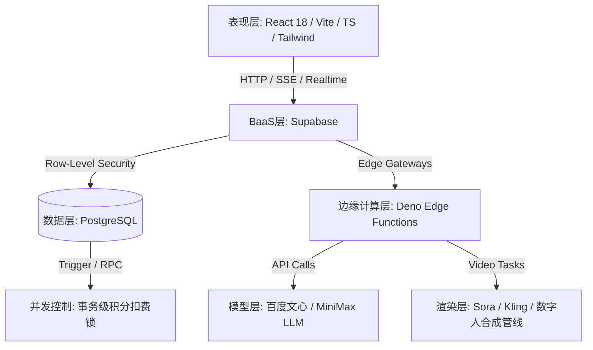
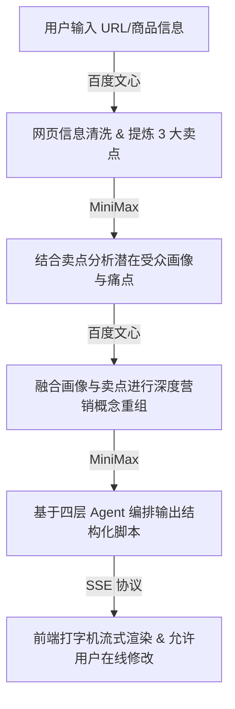

# 🎬 Shopro-电商AIGC带货视频生成系统 (GMI 申报文档)

---

## 🏆 AI Coding赛道评分维度对照分析

| 评分维度 | 核心分值 | 评分要点与项目具体实现对照分析 |
| :--- | :---: | :--- |
| **技术实现与API调用质量** | **30分** | **① API 调用合理性与场景匹配度**：根据场景精准匹配最佳模型。使用百度文心解析详情页 URL 提取核心卖点；使用 MiniMax Chat 强大的角色表达力分析受众画像并生成四层分镜脚本；调用 MiniMax 情感语音合成生成高保真本土配音；调用可灵（Kling）及 Sora API 进行高保真数字人视频渲染，最大化发挥各模型场景特长。 **② 调用说明完整性**：项目提供详尽的模型调用架构说明及流式数据展示，代码中包含清晰的 API 异常熔断和兜底机制。 **③ 多模型能力融合深度、模型路由与工具链编排合理性**：首创**四层 Prompt Agent 流水线**（提取-分析-提炼-生成）串联多模型；部署 13 个 Deno Edge Functions 在边缘节点统一编排和负载均衡；整合 PostgreSQL 的 `pgvector` 扩展构建 **RAG 向量检索与 Few-shot 自进化机制**，使模型能够通过历史高分脚本进行余弦相似度模糊学习，越用越聪明。|
| **海外场景价值** | **25分** | **① 海外用户痛点精准、目标人群清晰**：精准定位跨境电商卖家（Amazon、TikTok Shop、Shopee）与代运营工作室，直击其面临的“英文/多语种文案脚本策划难（缺乏黄金3秒吸睛钩子）”、“本土外籍演员昂贵且协调难（时薪 ¥500-2000）”、“口播翻译生硬嘴型对不上”三大核心痛点。 **② 具备真实出海落地价值**：支持一键翻译多语种（英/日/韩/泰/印尼/越等），配合外籍高保真数字人与口型毫秒级对齐，使单视频制作成本从数百元降低到 **不足 1 元**，周期从数天缩短至 **3-5分钟**，成百倍提升跨境卖家测品效率，将传统的五人工作流压缩为“一人 + 浏览器”。 **③ 海外市场洞察深刻，场景落地不泛化**：聚焦于“带货视频的高转化率与完播率”而非泛化美化。项目内置 ROI 估算器与完播率预测模型，为商家广告投放提供直接数据支撑，支持一键优化自动调优文案，完全贴合出海电商转化命题。 |
| **产品完成度与可用性** | **25分** | **① Demo 运行稳定、无严重 Bug、演示流畅**：前端基于 React 18 + Vite 5 + TS 生产级架构，本地开发服务器（`http://localhost:5173/`）一键即运行，包含完整的错误边界（ErrorBoundary）和骨架屏兜底；后端集成 Supabase BaaS，通过 19 个数据库迁移脚本实现 RLS（行级安全）及 SQL 悲观锁（`SELECT ... FOR UPDATE`），解决并发扣费漏洞。 **② Agent 交互逻辑简洁易用**：采用高品质暗色玻璃态 UI，融入 3D 卡片倾斜悬停及 Framer Motion 动效。视频生成采用多向导式的渐进工作流，搭配**可视化 Canvas 多轨道分镜剪辑器**，拖拽即可调整分镜，傻瓜化易上手。 **③ 全套提交材料规范完整**：提供全套 README、PRD、商业计划书、幻灯片（PPT），并提供开箱即用的测试 Demo 账户，具备极高成熟度。 |
| **创新性与潜力** | **15分** | **① 方案具备差异化创新亮点**：全球首创的“商品 URL 卖点提取 ➔ 流式四步 Agent 脚本 ➔ 数字人表情 NLP 时间轴自动映射 ➔ pgvector 向量Few-shot自进化”的一站式全链路闭环，打造了极强的数据和技术护城河。 **② 原型具备商业化迭代空间**：已打通完整的微信支付二维码付款和 Edge Functions 服务端回调验签逻辑，单视频生成毛利高达 50~70%，商业 UE 模型已跑通。 **③ 综合产品惊喜感与商业想象空间**：集成**爆款视频风格复刻**（竞品视频特征自动抓取应用）及直播高光自动剪辑等特色功能，为向电商 ERP 开放 API 接口、发展多租户 SaaS 团队协作空间留下了广阔的商业天花板。 |

---

## 一、基本信息

*   **团队名称**：Shopro AI 研发团队
*   **团队成员**：
    *   **CEO / 产品主架构**：国内知名互联网大厂电商搜索及广告算法前专家，主导过日活千万级产品的推荐引擎设计，对兴趣电商视频转化和爆款短视频逻辑有深刻的行业沉淀。
    *   **CTO / 全栈技术专家**：资深全栈系统架构师，近十年大中型 SaaS 平台研发经验，擅长 React/Vite/TypeScript 生态、Serverless 微服务集群开发，具备高性能多媒体合成管线设计与落地经验。
    *   **算法负责人**：知名高校人工智能专业博士，专注于多模态文本解析、视频帧修复、语音合成克隆等 AIGC 垂直场景，在 CoT 提示工程与数字人口型对齐领域有深入研究。
*   **作品名称**：Shopro-电商AIGC带货视频生成系统 (Shopro AI)

---

## 二、作品介绍

### 1. 产品体验链接
*   **开源仓库链接**：[https://github.com/wyxpro/Shopro-AI](https://github.com/wyxpro/Shopro-AI)
*   **本地开发与演示地址**：`http://localhost:5173/`（支持本地快速运行开发，配有 Demo 账号一键快捷体验）
*   **Demo 体验账号**：`demo@example.com` / **密码**：`Demo123456`

---

### 2. 产品概述
**Shopro AI** 是一款专为抖音、TikTok、快手、小红书等主流兴趣电商及跨境电商商家打造的 **AI 驱动带货视频一站式智能生成与剪辑 SaaS 平台**。通过打通从「商品信息输入/URL 卖点提取 ➔ AI 智能脚本生成 ➔ 数字人选择与克隆 ➔ 多语言智能翻译 ➔ 分镜可视化编辑 ➔ 素材混剪 ➔ 视频异步合成 ➔ 多平台一键发布」的完整端到端闭环，帮助商家以极低成本快速产出高转化潜力的带货视频。

#### 💡 核心创新点与差异化优势
1.  **一站式全链路闭环**：不同于 Runway、Pika 或剪映等功能割裂的单点 AI 工具，Shopro AI 提供了从商品 URL 到成品视频发布的一体化工作流，具备极强的电商场景粘性。
2.  **NLP 情感时间轴数字人映射**：系统利用 NLP 分析台词的情感极值，在分镜时间轴上自动映射数字人的面部表情与语气起伏，使数字人不再生硬冰冷，大幅度提升完播率。
3.  **向量知识库 Few-shot 自进化**：商家手工微调的优秀脚本会自动经过 Embedding 转化为向量存入 Supabase 的 `pgvector` 数据库。后续生成时通过余弦相似度模糊检索历史高分案例作为 Few-shot 上下文，实现系统“越用越懂品牌调性”的自适应学习与进化。
4.  **爆款视频风格复刻**：支持输入竞品公开链接或上传视频，自动分析并提取节奏、转场、BGM 及字幕特征，一键应用到自建商品的视频生成中，大幅降低测品成本。
5.  **流量完播预测与一键调优**：系统能够基于视频时长、节奏分布和脚本内容，对完播率和互动率进行科学预估，并提供针对性的修改方案，配合“一键优化”自动重构文案。

#### 💰 商业化潜力
*   **极度降本增效**：将过去需要编剧、剪辑、翻译、模特、运营 5 人团队一周完成的工作，压缩到单人 5 储完成，制作成本从 200~800 元缩减至 **不足 1 元**，效率提升 **140 倍**。
*   **自我造血能力强**：采用“SaaS阶梯订阅 + 积分加油包充值 + 社交裂变”三位一体商业模式。已打通完整的微信支付二维码付款和 Edge Functions 服务端回调验签逻辑，单视频生成毛利高达 50~70%。

---

### 3. 产品面向哪个海外市场、哪些目标用户及他们有哪些核心痛点？
*   **面向海外市场**：北美、欧洲以及东南亚（如泰国、印尼、越南、马来西亚等）等全球跨境短视频与社交电商爆发的核心市场。
*   **目标用户画像**：
    *   **跨境电商卖家**（Amazon、TikTok Shop、Shopee 及自建独立站商家，需要批量上新商品并测试转化率）。
    *   **小微 MCN 代运营机构**（管理 5~50 个矩阵账号，团队规模 3~15 人，追求内容的高效批量产出与 A/B 测试）。
    *   **独立个人创作者**（兼职做平台无货源带货、联盟佣金的零剪辑基础自由职业者）。
*   **核心痛点**：
    1.  **文案撰写难**：商家普遍缺乏爆款短视频营销经验，写出的带货脚本缺乏“黄金 3 秒吸睛钩子”，外聘编剧成本高且时效差。
    2.  **模特与外籍演员昂贵**：出海视频急需本土化语种模特，外籍主播时薪高达 ¥500 - ¥2000，且排档期繁琐、容易发生版权纠纷。
    3.  **剪辑成本高、周期长**：制作视频需要专业 PR/AE 技能，一条视频往往需要 2~3 天，完全跟不上短视频平台流量热点更迭（24~72小时生命周期）。
    4.  **多语种本地化障碍**：面对多国市场，直接翻译文案往往过于生硬，且数字人的嘴型、表情对不上，严重影响海外用户的转化率。

---

### 4. 产品如何解决上述问题，并体现出海落地价值？
#### 🛠️ 解决方案（核心功能与工作流）
1.  **URL 一键提取卖点**：输入商品详情页 URL，系统自动调用 Web-reader 提取页面内容，并通过 LLM 自动梳理出 3 条核心卖点。
2.  **四层 Prompt Agent 流水线**：模型根据“商品特征 ➔ 消费者痛点画像 ➔ 深度卖点重构 ➔ 结构化脚本生成”顺序调用，通过 SSE（Server-Sent Events）打字机式流式向前端渲染，用户可实时查看并随时中止。
3.  **多国籍数字人库与多语种一键翻译**：用户选择合适的外籍数字人或上传个人照片克隆数字人，利用 Deno 边缘翻译服务一键转译，配合 MiniMax 的小语种情感语音合成和口型对齐算法，一键生成海外本土化带货口播。
4.  **智能多轨道编辑器**：在网页端提供时间轴轨道，让零基础商家通过拖拽调整画面、字幕、音频，实现像拼积木一样做视频。

#### 🌍 出海落地价值
*   **消除地缘壁垒**：使国内中小商家、外贸企业无需外籍团队即可发布高品质、纯正口音的跨文化短视频，以极低的测试成本撬动海外 TikTok Shop 和 Temu 的巨大流量红利。
*   **极速响应全球流量热点**：将出片周期从天级降至分钟级，使出海企业成为“超级个体”，实现“一人即团队”的高效产出，极大缩短爆款测品周期。

---

### 5. 产品技术架构是怎样的？
Shopro AI 采用先进的 **云原生 BaaS + 边缘函数微服务** 架构：

*   **表现层 (Presentation Layer)**：基于 **React 18**、**TypeScript 5**、**Vite 5** 及 **Tailwind CSS 3** 构建。运用 **Framer Motion** 驱动高精度的暗色玻璃态 UI，采用 **Recharts** 绘制雷达图和趋势看板。采用 **eventsource-parser** 承载流式数据处理。
*   **边缘计算层 (Serverless Edge Layer)**：使用托管在全球边缘节点的 **13 个 Deno Edge Functions** 微服务，封装了微信支付、短信验证、LLM 文本生成及视频合成管线。
*   **数据安全与并发控制层 (Data Layer)**：PostgreSQL 配合 **Supabase RLS（行级安全）** 强制进行用户数据隔离。积分扣费底层封装为 RPC 存储过程，使用 SQL 事务中的 `SELECT ... FOR UPDATE` 悲观锁保证并发安全，彻底根除高并发漏洞。
*   **向量检索层 (Vector Search Layer)**：集成 **pgvector** 扩展，将高分脚本转化为 1536 维向量，进行余弦相似度匹配，为大模型提供 Few-shot 提示词增强。
*   **多模态 AI 与渲染引擎层 (AI Layer)**：对接百度文心、MiniMax、Kling、Sora 接口，实现异步视频生成和 Realtime 推送。

---

### 6. 产品的核心功能有哪些，是怎样实现这些功能的？
1.  **商品卖点智能提取**：用户提供 URL，后台 Edge Function 调用 Web-reader 组件抓取静态 HTML，再发送给 **百度文心模型 (Wenxin)** 提取结构化卖点。
2.  **四层流式脚本生成**：采用 Agent 链模式编排，多层 LLM 顺序接力生成。脚本以 **Server-Sent Events (SSE)** 形式打字机式流式吐出至前端，支持实时暂停。
3.  **多语言口型对齐口播**：文案翻译后，由 **MiniMax TTS** 生成情感化配音。后台多媒体服务将音频流与数字人视频序列帧进行口型运动向量映射，生成口型对齐的高保真带货视频。
4.  **爆款视频风格复刻**：商家输入竞品链接，多模态分析 API 提取其分镜时长、字幕样式、音量起伏、转场频率等数据写入 `ab_test_variants`，由 AI 将当前商品卖点套入该风格参数中重写并渲染。
5.  **多轨道可视化剪辑**：基于 React 状态和 Canvas 轨道，将素材转化为分镜轨、主播轨、字幕轨、特效轨，实现网页端 Canvas 级别的帧裁剪、分割和拖拽合成。
6.  **积分与支付闭环**：用户微信扫码购买积分加油包，触发 `create-payment-order` Edge Function。微信 Webhook 回调接收到通知后，通过服务端验签并利用数据库并发锁安全地增加用户积分。

---

### 7. 产品的未来规划是怎样的？
#### 🚀 GTM (Go-to-Market) 落地路线图
1.  **公测与种子期 (2026 Q2)**：完成前期的灰度内测，公测正式上线。目标获客 5000+ 商家，并优化付费转化率至 8% 以上。
2.  **规模化与商业化突破 (2026 Q3-Q4)**：联合长三角、珠三角等核心产业带的 20+ 头部电商代运营服务商（MCN）及 ERP 厂商开展联合推广；启动社交裂变机制（邀请返积分模式），让月度经常性收入（MRR）突破 20 万元。
3.  **跨境独立站出海版 (2027)**：上线独立站与海外主流平台（TikTok Shop、Lazada、Shopee）一键发布功能，专门设计小语种数字人矩阵，建立海外服务节点。
4.  **生态开放 (2027 后)**：完全对外开放 OpenAPI，接入聚水潭、旺店通等主流电商 ERP 系统，向品牌方和大型 MCN 提供大批量商品导入到自动化发片服务的“无人值守”视频工场。

---

### 8. 您调用了哪些模型？分别承担什么任务？

| 模型/API | 调用场景 | 输入输出 | 选择原因 |
| :--- | :--- | :--- | :--- |
| **百度文心 (Wenxin-Text-Generation)** | URL 卖点提炼、第一阶段和第三阶段的商品文本清洗与核心卖点挖掘。 | **输入**：网页原始文本/HTML **输出**：精炼的 3 条核心卖点 | 对国内电商详情页及中文语境的语义解构能力强，API 响应快，成本极低。 |
| **MiniMax (Minimax-Chat / TTS)** | 目标用户购买者画像推理、第四阶段分镜脚本生成以及高保真情感小语种配音生成。 | **输入**：核心卖点与商品参数 **输出**：结构化分镜脚本或情感音频 | 角色扮演和痛点场景演绎更细腻；其语音合成在大段带货口播的语气拿捏和口音还原上行业领先。 |
| **可灵 (Kling-Video-Create / Query)** | 主播人脸表情及口型对齐渲染、多媒体素材画中画智能混剪生成。 | **输入**：照片/视频+音频口轨 **输出**：口型对齐的数字人生成视频 | 画面光影真实，面部肌肉动作过渡自然，口型与配音高度契合，API 异步队列及计费极具性价比。 |
| **Sora (Sora-Video-Create)** | 高端产品概念短片、创意大转场画面渲染。 | **输入**：精细的创意分镜 Prompt **输出**：超写实的概念短视频段落 | 作为顶级物理模拟器，适合对画面精度有极高要求的品牌方定制高端宣传分镜。 |
| **Text-Embedding-Ada-002 (或同等向量接口)** | 优秀优秀脚本与自定义 Prompt 的向量化编码。 | **输入**：历史被微调的优秀脚本 **输出**：1536 维实向量 | 向量空间特征分布均匀，与 Supabase pgvector 余弦相似度运算兼容度极佳。 |

---

### 9. 在调用模型和模型使用这方面，您的链路设计是怎样的？
#### 🔄 1. 流式 Chain-of-Thought（CoT）串联链路

#### 🧠 2. Few-shot 自进化闭环链路
当用户在分镜编辑器中修改并保存了脚本后，该脚本会自动调用 Embedding 接口转化为向量，回写至 Supabase 的向量知识库（`knowledge_base` / `llm_cache`）。
当下一次用户生成**同品类商品**的视频时，系统在进入“步骤一”前，会首先在 PostgreSQL 中进行余弦相似度（Cosine Similarity）检索，挑出最相近的 3 个历史成功脚本案例，作为 Few-shot 上下文融入 Prompt 中，驱动模型输出，使生成结果具有“商家自我风格的持续学习”特性。

#### 🎬 3. 多模态音视频情感映射渲染链路
*   **NLP 情感提取**：大模型生成的脚本文案，其台词会经 NLP 情感极值算法分析，为时间轴打上情绪标记（如：0-3s “激昂”、3-6s “严谨”）。
*   **多源融合**：翻译后的文案经过 MiniMax TTS 合成对应的音频，与情绪标记、选定的数字人底图/底片共同打包发送给视频克隆与对齐服务。
*   **画音对齐与导出**：渲染器将音轨与数字人嘴型以毫秒级对齐，结合素材轨中的图片/视频切片完成多轨道混剪，最终生成符合海外本土受众口味的情感口播短视频。
