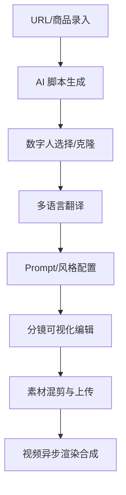

# 🛒 Shopro-电商AIGC带货视频  
[](https://react.dev) [](https://www.typescriptlang.org) [](https://vitejs.dev) [](https://supabase.com) [](https://tailwindcss.com) [](https://reactrouter.com) [](https://www.radix-ui.com) [](https://biomejs.dev)

---

##  💎 项目简介

**Shopro-电商AIGC带货视频** 是一款专门解决抖音/TikTok/快手/小红书电商商家在短视频营销中“痛点”（文案撰写难、数字人外籍演员贵、剪辑成本高、跨平台发布低效）的 SaaS 平台。通过「商品信息输入/URL 卖点提取 ➔ AI 智能脚本生成 ➔ 数字人选择与克隆 ➔ 多语言智能翻译 ➔ 分镜编辑 ➔ 素材混剪 ➔ 视频异步合成 ➔ 多平台一键发布」的完整端到端闭环，帮助商家以极低成本快速产出高转化潜力的带货视频。

### ⚡ 核心价值
*   **降低制作成本**：无需雇佣专业剪辑师与外籍主播，AI 一键生成数字人带货视频。
*   **提升生成效率**：从商品 URL 到生成多语种短视频仅需几分钟，完美响应平台热点。
*   **高转化潜力**：基于爆款风格分析和雷达对比图，优化分镜与文案，提炼核心卖点。
*   **全端自适应**：Web 端设计完美适配桌面端与移动端，并支持全系统深色/浅色主题的无缝切换。

---

## 🛠️ 技术栈

项目采用了现代化的**前端单页应用 + 后端无服务器 (BaaS) 架构**，配合多重 AI 大模型能力实现端到端的智能化流程。

### 💻 前端技术栈 (Frontend Stack)

| 技术 / Technology | 核心版本 / Version | 关键作用与特性 / Key Role & Features |
| :--- | :--- | :--- |
| **React** | `^18.3.1` | 界面构建与状态挂载，利用 React 18 并发渲染保障复杂视图的流畅度。 |
| **TypeScript** | `^5.5.3` | 提供严格的静态类型定义、接口约束和安全的组件开发保障。 |
| **Vite** | `^5.4.1` | 采用 SWC 编译器的高速前端开发构建服务器，提供秒级热更新 (HMR)。 |
| **React Router DOM** | `^6.26.2` | 路由级懒加载和统一页面状态转换。 |
| **TanStack Query** | `^5.56.2` | 提供高效的 API 请求缓存、实时状态同步及请求生命周期管理。 |
| **Tailwind CSS** | `^3.4.11` | 结合 `tailwind-merge` 与 CSS 变量实现深浅主题 of 自适应界面。 |
| **Radix UI / Shadcn** | `*` | 封装了抽屉 (Vaul)、侧边栏、对话框等符合 Web Accessibility 标准 of 原子交互组件。 |
| **Framer Motion** | `^12.4.10` | 用于实现 3D 悬停微动效、卡片倾斜、过渡滚动和流式占位动效。 |
| **Recharts** | `^2.12.7` | 绘制竞品监控雷达图、带货视频 ROI 及播放量趋势分析图。 |
| **`xlsx` / `jspdf`** | `*` | 支持商品信息表格批量导入、导出，以及报表 PDF 的前端直接生成。 |
| **`qrcode` / SSE (流解析)** | `*` | 动态绘制用户邀请推广海报，并使用 `eventsource-parser` 解析 AI 流式文本。 |
| **Biome / TSGo** | `2.4.5` | 用于代码语法分析、规范性 Lint 静态校验以及 TypeScript 类型健壮性检查。 |

### 🗄️ 后端与基础设施 (Backend Stack)

| 技术 / Technology | 核心版本 / Version | 关键作用与特性 / Key Role & Features |
| :--- | :--- | :--- |
| **PostgreSQL (Supabase)** | `*` | 基于行级安全策略 (RLS) 的关系型数据库，实现用户数据、模板等物理隔离。 |
| **Supabase BaaS** | `^2.103.1` | 托管身份验证 (GoTrue)、云存储 (Storage) 及实时数据库同步 (Realtime)。 |
| **Deno Edge Functions** | `*` | 运行在边缘节点的微服务函数，处理 AI 文本/视频生成、短信验证和微信支付。 |

### 🤖 AI 与多模态服务 (AI & Multimodal Services)

| 技术 / Technology | 核心版本 / Version | 关键作用与特性 / Key Role & Features |
| :--- | :--- | :--- |
| **百度文心 / MiniMax** | API 接入 | 负责商品详情页 URL 卖点提炼、四层脚本生成流水线及智能对话微调。 |
| **卷影 Sora / 快手可灵** | API 接入 | 驱动文本/图生视频 (Image-to-Video) 的异步渲染合成。 |

---

## 📁 目录结构

```text
Shopro AI/
├── .rules/               # 静态规则校验与本地测试脚本
├── docs/                 # 核心文档目录
│   └── prd.md            # 完整产品需求文档 (PRD, 包含验收标准及异常边界)
├── supabase/             # Supabase 后端服务配置
│   ├── config.toml       # Supabase 本地开发配置文件
│   ├── schema.sql        # 包含表结构、索引、视图及 RPC 存储过程的数据库初始化 SQL
│   ├── migrations/       # PostgreSQL 版本迁移历史文件目录
│   └── functions/        # Deno Edge Functions (微服务函数)
│       ├── ai-assistant/            # AI 智能助手/流式脚本生成
│       ├── phase3-assistant/        # 阶段3核心 AI 对话服务 (竞品监控、直播 ASR、API Key 管理等)
│       ├── create-payment-order/    # 微信支付下单生成二维码
│       ├── wechat-payment-webhook/  # 微信支付成功回调处理
│       ├── kling-video-create/      # 可灵视频合成任务提交
│       ├── kling-video-query/       # 可灵视频状态查询
│       ├── sora-video-create/       # Sora 视频合成任务提交
│       ├── sora-video-query/        # Sora 视频状态查询
│       ├── minimax-chat/            # Minimax 大语言模型对话
│       ├── send-sms-code/           # 短信验证码发送
│       ├── verify-sms-code/         # 验证码核验接口
│       ├── setup-demo/              # 初始化 Demo 体验用户
│       └── wenxin-text-generation/  # 百度文心文本生成 (卖点提炼)
├── src/                  # 前端源码
│   ├── assets/           # 静态资源、Logo 和 SVG 图标
│   ├── components/       # 公共可复用组件
│   │   ├── layouts/      # 布局组件 (包含侧边栏的主布局 MainLayout)
│   │   └── ui/           # 原子级 UI 组件 (基于 Shadcn/UI，含 MagneticButton 等)
│   ├── contexts/         # 全局上下文 (AuthContext 认证管理)
│   ├── db/               # 客户端数据库交互层
│   ├── hooks/            # 自定义 React Hooks (用以支持积分计算 useCredits, 草稿缓存 useDraft)
│   ├── lib/              # 工具函数 (CN 样式合并等)
│   ├── pages/            # 页面级别组件 (共 41 个核心业务页面)
│   ├── routes.tsx        # 路由定义映射表
│   ├── types/            # TypeScript 全局接口和实体定义
│   ├── App.css           # 应用级 CSS
│   ├── App.tsx           # 应用根入口 (全局 Toaster、Sonner 提示及路由挂载)
│   ├── index.css         # Tailwind 全局指令与深浅主题变量定义
│   └── main.tsx          # 前端构建入口
├── package.json          # 依赖清单和任务脚本
├── tsconfig.json         # TypeScript 配置
└── vite.config.ts        # Vite 生产环境构建配置
```

---

## ⚡ 核心功能模块和工作流程

系统以**视频创作生产线**为核心，配合**爆款复刻**、**流量分析**、**知识库进化**和**商业化充值**四大外围模块形成完整闭环。

### 🔄 1. 带货视频生成流水线



1.  **商品信息录入**：支持手动录入或输入商品 URL。系统自动提取详情页内容，调用文心大模型（`wenxin-text-generation`）提炼出 3 条核心卖点。
2.  **AI 智能脚本生成**：采用**四层 Prompt 流水线**（商品提取 ➔ 用户画像 ➔ 卖点提炼 ➔ 分镜脚本），顺序调用大模型，生成带有台词和画面的结构化分镜，并支持 SSE 流式实时展示。
3.  **数字人配置**：可从数字人库中挑选已有模特，或上传照片/视频，提交克隆任务。克隆完成后，AI 通过情绪 NLP 分析在情绪时间轴上可视化模特在不同分镜下的表情。
4.  **多语言翻译**：支持一键将脚本台词翻译为多国语言（英/日/韩/泰/越等），用户可在线微调翻译结果。
5.  **Prompt 与风格配置**：选择预设模板（20+ 款内置电商场景）及字幕和 BGM，自动生成用于驱动视频生成的详细 Prompt 文案。
6.  **可视化分镜编辑**：进入分镜编辑器，支持拖拽调整镜头顺序、增删镜头、单独修改时长及画面描述。
7.  **素材上传与混剪**：拖拽上传商品素材（大文件分片并带有骨架屏占位与流式日志加载），智能匹配分镜生成混剪草稿。
8.  **异步视频生成**：点击生成后，任务提交至 Supabase 数据库任务队列。前端采用 Realtime 订阅推送同步展示生成百分比及流式运行日志，完成后可供在线播放及 480P/720P 下载。

### 📈 2. 爆款复刻与流量分析流程
*   **爆款复刻**：用户粘贴竞品爆款视频链接 ➔ 调用 `phase3-assistant` 中的 `crawl_competitor` 获取竞品视频节奏、转场、字幕及 BGM 特征 ➔ 生成可视化分析报告，并支持一键应用到当前商品的视频生成中。
*   **流量分析与优化**：输入视频特征与商品信息 ➔ 调用流量预测接口 ➔ 预测视频完播率与互动率，自动改写脚本并重设 Prompt ➔ 呈现优化前后对比数据，方便商家预估 ROI / 投产比。

### 🧠 3. 知识反馈与检索流程
*   **数据回写**：用户手动修改并最终导出的优质分镜脚本及 Prompt 被安全回写至 Supabase 数据库。
*   **向量化检索**：脚本内容经过 Embedding 向量化，存入数据库，支持后续的语义全文检索，形成商家的“私有专属带货知识库”，实现 AI 的持续自我进化。

### 💳 4. 商业化及积分系统流程
*   **微信支付**：用户选择加油包或升级套餐 ➔ 调用 `create-payment-order` Edge Function ➔ 生成微信支付二维码 ➔ 支付完成触发 `wechat-payment-webhook` 回调 ➔ 自动秒级充值积分。
*   **邀请有礼**：前端动态生成包含专属邀请链接的二维码 ➔ 绘制精美的微信分享海报提供下载 ➔ 被邀请人通过邀请码注册验证邮箱，两人均获得系统奖励积分。

### 🔐 5. 统一身份验证与免密体验流程
*   **多模式身份验证**：支持「用户名 + 密码」注册登录，以及「手机号 + 短信验证码」的高效短信登录与注册绑定。
*   **注册初始化赠送**：新用户首登时触发创建 `profiles` 记录，并自动绑定「免费版」套餐，赠送 100 积分体验额度。
*   **快速免密体验通道**：在登录界面提供 `demo_user` 与 `test_user` 快捷登录入口，自动流转注册与初始化，方便评审和快速预览系统。

### 👥 6. 团队协同与开放平台流程
*   **团队空间与邀请机制**：支持创建专属协作空间，生成 7 天有效的邀请链接，实现多人同台剪辑与协作。
*   **角色与权限控制 (RBAC)**：细分所有者 (Owner)、管理员 (Admin)、编辑者 (Editor)、观察者 (Viewer) 四级角色，严格适配不同管理范围及操作读写权限。
*   **API Key 开放平台**：支持基于前端生成安全哈希 (SHA-256) 的开放密钥，具有防泄露的 prefix 设计、自定义 scopes 授权及 QPS 限制，完美对接企业外部自研系统。

---

## ⚙️ 部署指南

### 1. 前端本地启动
#### 环境要求
*   **Node.js**：建议使用 `>= 20.x` (例如 v20.18.3)
*   **包管理器**：建议使用 **pnpm** 或 **npm**

#### 安装依赖与运行
```bash
# 进入项目根目录
cd "Shopro AI"

# 安装所有依赖
npm install

# 本地启动前端开发服务器 (使用指定的开发配置文件)
npx vite --config vite.config.dev.ts --host 127.0.0.1
```
*提示：由于 package.json 的 `dev` 命令被预设为 lint 校验提醒，请直接使用上面的 `npx vite --config vite.config.dev.ts` 启动。*

### 2. 后端部署 (Supabase)
#### 安装 Supabase CLI
```bash
# 使用 npm 全局安装 CLI
npm install -g supabase
```

#### 初始化与链接
```bash
# 登录 Supabase
supabase login

# 在本地目录初始化项目
supabase init

# 链接本地项目到你在 Supabase 平台创建的云端 Project
supabase link --project-ref your-project-reference-id
```

#### 数据库初始化
将本项目的数据库结构同步至云端数据库：
*   **方法一**：通过 CLI 推送迁移文件：
    ```bash
    supabase db push
    ```
*   **方法二**：将 `supabase/schema.sql` 中的内容全部复制，粘贴至 Supabase 控制台的 **SQL Editor** 中执行，一键建立所有的数据表、行级安全策略（RLS）、索引、数据库视图以及积分扣费存储过程。

#### 部署边缘函数 (Edge Functions)
配置第三方大模型和支付等 API Keys 后，一键部署边缘函数：
```bash
# 部署所有 Edge Functions
supabase functions deploy

# 或者单独部署某个功能，如文心大模型生成接口：
supabase functions deploy wenxin-text-generation
```

#### 配置环境变量 (Secrets)
在部署的后端中需配置第三方大模型的 Token 或支付秘钥：
```bash
supabase secrets set WENXIN_API_KEY=your_key WENXIN_SECRET_KEY=your_secret
supabase secrets set MINIMAX_API_KEY=your_key
supabase secrets set WECHAT_PAY_MCH_ID=your_mch_id WECHAT_PAY_API_KEY=your_pay_key
```

---

## 📦 API 接口

系统后端 Edge Functions 提供了标准的 RESTful 及 SSE 流式交互接口：

| 服务函数路径 | 请求方法 | 功能描述 | 核心入参 (Payload) | 返回值示例 / 传输协议 |
| :--- | :--- | :--- | :--- | :--- |
| `/functions/ai-assistant` | `POST` | 处理流式 AI 脚本生成 | `productId`, `platform`, `language` | `text/event-stream` (SSE 流式) |
| `/functions/phase3-assistant` | `POST` | P3 核心功能聚合接口 (竞品、高光、API Key、发布、偏好) | `{ action: "add_competitor" \| "crawl_competitor" \| "analyze_live_highlight" \| "generate_api_key" \| "revoke_api_key" \| "create_publish_task" \| "publish_video" \| "update_style_preference" \| "generate_personalized_script", ... }` | `{ code: 0, data: { ... } }` |
| `/functions/wenxin-text-generation` | `POST` | 百度文心文本生成及卖点提炼 | `url` (商品链接) | `{ status: 200, points: [...] }` |
| `/functions/minimax-chat` | `POST` | Minimax 对话交互及脚本优化 | `messages` | `{ reply: "..." }` |
| `/functions/sora-video-create` | `POST` | 提交 Sora 视频渲染生成任务 | `prompt`, `duration`, `aspectRatio` | `{ success: true, taskId: "..." }` |
| `/functions/sora-video-query` | `GET` | 查询 Sora 视频生成状态与下载链接 | `taskId` | `{ status: "processing/completed", url: "..." }` |
| `/functions/kling-video-create` | `POST` | 提交快手可灵视频生成任务 | `prompt`, `images` | `{ success: true, taskId: "..." }` |
| `/functions/kling-video-query` | `GET` | 查询可灵视频状态与下载链接 | `taskId` | `{ status: "completed", url: "..." }` |
| `/functions/create-payment-order` | `POST` | 微信支付下单生成预付款二维码 | `packageId`, `amount` | `{ codeUrl: "weixin://...", orderId: "..." }` |
| `/functions/wechat-payment-webhook` | `POST` | 微信支付回调处理，更新积分余额 | 微信官方回调 Payload | XML / JSON 回应确认 |
| `/functions/send-sms-code` | `POST` | 发送手机短信验证码 | `phone` | `{ success: true }` |
| `/functions/verify-sms-code` | `POST` | 核验短信验证码 | `phone`, `code` | `{ verified: true }` |
| `/functions/setup-demo` | `POST` | 初始化测试/演示用户及数据配置 | `{}` | `{ success: true, userId: "..." }` |

---

## 👾 项目代码及界面规模

系统整体规模庞大，具有丰富的业务模块和完整的高保真界面支持。

### 📊 代码统计
*   **React 视图组件 (`.tsx`)**：**114** 个文件，累计 **29,442** 行代码。
*   **TypeScript 核心逻辑 (`.ts`)**：**10** 个前端文件 + **13** 个 Edge Function 文件，累计 **2,478** 行代码。
*   **PostgreSQL 脚本与函数 (`.sql`)**：**20** 个文件，累计 **6,944** 行代码。
*   **总文件数与行数**：**157** 个核心源码文件，总行数达到 **38,864** 行（包含复杂的数据库触发器、行级安全及流式 SSE 渲染控制）。

### 🖥️ 界面规模
前端内置了 **41** 个核心页面文件 (`src/pages`)，包含但不限于：
1.  **项目官网宣传页 (`LandingPage.tsx`, ~47KB)**：支持 3D 卡片、数据滚动动画和多维雷达对比图。
2.  **多轨道视频编辑器 (`VideoEditPage.tsx`, ~134KB)**：提供专业的多轨道交互（视频轨、音频轨、字幕轨、特效轨），支持镜头拖动、裁切及实时 Canvas 预览。
3.  **高保真带货视频生成主页 (`VideoCreatePage.tsx`, ~88KB)**：支持商品录入、流式脚本生成与数字人克隆模型配置。
4.  **数据分析大屏看板 (`AnalyticsPage.tsx`, ~42KB)**：使用 Recharts 动态展示短视频 ROI、播放量和多平台占比。
5.  **AI 工具箱 (`AiToolboxPage.tsx`, ~18KB)**：包含爆款文案重写、多语种翻译、高光提取等模块的卡片化快速入口。
6.  **商品管理与作品库 (`ProductsPage.tsx`, ~67KB / `WorksPage.tsx`, ~49KB)**：内置高保真预览示例数据，方便商家即开即用。
7.  **团队协作空间 (`TeamSpacePage.tsx`, ~18KB)**：支持创建与切换团队，通过共享链接邀请成员，支持成员角色权限（所有者/管理员/编辑者/观察者）的精细分配，底层实施 RLS 行级安全控制。
8.  **开放平台 API Key 管理 (`OpenAPIPage.tsx`, ~17KB)**：提供开发密钥生命周期管理，集成 cURL 和 JavaScript/TypeScript 快速接入接口文档。

---

## 💡 常见问题 (FAQ)

### Q1: 本地启动提示 `Do not use this command...`，如何正常预览开发？
因为本项目在 package.json 中禁用了直接使用全局 `npm run dev` 运行，目的在于防止因环境差异导致配置文件冲突。请使用以下命令显式指定开发配置文件：
```bash
npx vite --config vite.config.dev.ts
```

### Q2: 如果没有本地配置的 Supabase 环境，可以使用在线版的吗？
可以。您可以直接使用 Supabase Cloud 官网提供的免费层级。在控制台创建一个 Project 之后，将 `supabase/schema.sql` 中的全部 SQL 在 SQL Editor 中执行即可初始化表结构。然后修改本地的 `.env` 环境变量：
```env
VITE_SUPABASE_URL=https://您的项目ID.supabase.co
VITE_SUPABASE_ANON_KEY=您的匿名公钥
```

### Q3: AI 脚本生成支持流式输出吗？是如何实现的？
支持。为了给用户提供流畅的“打字机”生成体验，`/functions/ai-assistant` 接口在 Deno 边缘端通过 SSE (Server-Sent Events) 协议下发数据，前端使用 `eventsource-parser` 解析二进制流并实时更新 React 状态，草稿数据会同步在浏览器的 LocalStorage 中保存，防止意外断网导致文案丢失。

### Q4: 积分扣减机制在高并发时如何防止“薅羊毛”超支？
项目没有在前端或边缘函数中直接加减积分。所有的扣费逻辑都封装在 PostgreSQL 的 RPC 存储过程（如 `00009_be07_credit_deduct_rpc.sql` 和 `00013_rate_limit_rpc_and_deduct_credits_v2.sql`）中。扣费时，使用 SQL 事务锁（`SELECT ... FOR UPDATE`）锁住当前用户的积分行，校验余额足够后方执行扣减并返回成功，从而完全避免并发安全漏洞。

### Q5: 个性化偏好（用户定制风格）是如何在生成脚本中产生 Few-shot 效果的？
在 `phase3-assistant` 中，调用 `generate_personalized_script` 时，系统会从数据库中首先读取用户的偏好设置（如风格、语气、常用钩子），并查询出该用户历史创作中评价最高的 3 篇优质脚本。系统会将这些信息组合作为 Context 及 Few-shot 样本拼接在 Prompt 中发给大语言模型，从而使生成的脚本无限贴近商家的专属风格。
