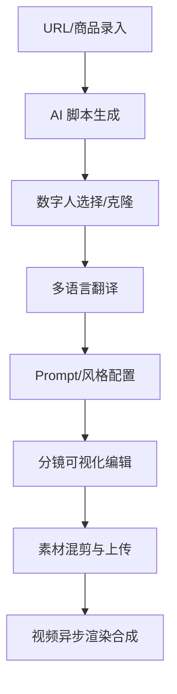

# 🎬 电商 AIGC 带货视频生成系统 (脚本大师.ai)

面向跨境电商商家的 AI 驱动带货视频一站式智能生成与剪辑系统。通过「商品信息输入/URL 卖点提取 ➔ AI 智能脚本生成 ➔ 数字人选择与克隆 ➔ 多语言智能翻译 ➔ 分镜编辑 ➔ 素材混剪 ➔ 视频异步合成 ➔ 多平台一键发布」的完整端到端闭环，帮助商家以极低成本快速产出高转化潜力的带货视频。

       

---

## 📋 项目简介

**电商 AIGC 带货视频生成系统** (又名：**脚本大师.ai / ScriptGenius.ai**) 是一款专门解决抖音/TikTok/快手/小红书跨境电商商家在短视频营销中“痛点”（文案撰写难、数字人外籍演员贵、剪辑成本高、跨平台发布低效）的 SaaS 平台。

### 🌟 核心价值
- **降低制作成本**：无需雇佣专业剪辑师与外籍主播，AI 一键生成数字人带货视频。
- **提升生成效率**：从商品 URL 到生成多语种短视频仅需几分钟，完美响应平台热点。
- **高转化潜力**：基于爆款风格分析和雷达对比图，优化分镜与文案，提炼核心卖点。
- **全端自适应**：Web 端设计完美适配桌面端与移动端，并支持全系统深色/浅色主题的无缝切换。

---

## 🛠️ 技术栈

项目采用了现代化的**前端单页应用 + 后端无服务器 (BaaS) 架构**，配合多重 AI 大模型能力实现端到端的智能化流程。

### 💻 前端技术架构
- **核心框架**：React 18.3.1 + TypeScript 5.5.3
- **构建工具**：Vite 5.4.1 (搭载 SWC 快速编译器)
- **路由管理**：React Router DOM 6.26.2 (实现路由级懒加载与页面级占位 Loader)
- **状态管理 & 数据拉取**：TanStack React Query v5 (提供高效的 API 缓存和同步)
- **UI & 样式系统**：
  - Tailwind CSS 3.4 + Tailwind CSS Animate (实现暗黑模式自适应及平滑动画)
  - Radix UI Primitives (无障碍交互组件底层) + Shadcn/UI (极简现代风格卡片和表单)
  - Framer Motion 12 (3D 卡片悬停倾斜、视差滚动、按钮点击波纹等高级微动效)
- **数据可视化**：Recharts (渲染竞品对比雷达图、播放量与 ROI 趋势图)
- **前端工具库**：
  - `xlsx` & `jspdf`：商品/数据批量导入导出与报表生成。
  - `qrcode` & `@types/qrcode`：生成包含用户专属邀请二维码的分享海报。
  - `eventsource-parser`：流式 SSE 输出解析器，用于实时展示 AI 脚本生成过程。

### ☁️ 后端服务 (Supabase)
- **身份验证 (Auth)**：邮箱注册激活、重置密码及 Demo 体验免注册通道。
- **数据库 (PostgreSQL)**：配置行级安全策略 (RLS)，保障数字人库、视频模板和用户数据的安全隔离。
- **数据库存储过程 & 触发器 (PL/pgSQL)**：
  - 用户注册自动触发 Profile 初始化。
  - 积分消费防并发超额扣除 (使用事务级 RPC 锁控制)。
  - 全文搜索 (FTS) 商品与语义检索 (Vector Embedding) 历史知识。
- **云存储 (Storage)**：托管大容量的音视频素材、混剪产物、分享海报和用户头像。
- **边缘计算 (Edge Functions)**：部署基于 Deno 的微服务接口，负责对接微信支付、大语言模型和视频合成服务。

### 🤖 AI 大模型 & 多模态集成
- **大语言模型 (LLM)**：百度文心一言 (Wenxin) / Minimax (用于 URL 卖点提炼、四层脚本生成流水线)。
- **视频生成模型**：Sora API / 快手可灵 (Kling) API 异步视频生成。
- **数字人克隆**：上传照片或短视频自动训练生成克隆人，结合 NLP 进行情绪时间轴规划。
- **多语言翻译**：支持英语、日语、韩语、泰语、越南语等多语种带货文案自动翻译与配音。

---

## 📁 目录结构

```text
Shopro AI/
├── .rules/               # 静态规则校验与本地测试脚本
├── docs/                 # 核心文档目录
│   └── prd.md            # 完整产品需求文档 (PRD, 包含验收标准及异常边界)
├── supabase/             # Supabase 后端服务配置
│   ├── config.toml       # Supabase 本地开发配置文件
│   ├── schema.sql        # 包含表结构、索引、视图及 RPC 存储过程的数据库初始化 SQL
│   ├── migrations/       # PostgreSQL 版本迁移历史文件目录
│   └── functions/        # Deno Edge Functions (微服务函数)
│       ├── ai-assistant/            # AI智能助手/流式脚本生成
│       ├── create-payment-order/    # 微信支付下单生成二维码
│       ├── kling-video-create/      # 可灵视频合成任务提交
│       ├── kling-video-query/       # 可灵视频状态查询
│       ├── minimax-chat/            # Minimax大语言模型对话
│       ├── phase3-assistant/        # 阶段3核心AI对话服务
│       ├── send-sms-code/           # 短信验证码发送
│       ├── sora-video-create/       # Sora视频合成任务提交
│       ├── sora-video-query/        # Sora视频状态查询
│       ├── verify-sms-code/         # 验证码核验接口
│       ├── wechat-payment-webhook/  # 微信支付成功回调处理
│       └── wenxin-text-generation/  # 百度文心文本生成(卖点提炼)
├── src/                  # 前端源码
│   ├── assets/           # 静态资源、Logo 和 SVG 图标
│   ├── components/       # 公共可复用组件
│   │   ├── layouts/      # 布局组件 (如包含侧边栏的主布局 MainLayout)
│   │   └── ui/           # 原子级 UI 组件 (基于 shadcn/ui，含 MagneticButton 等)
│   ├── contexts/         # 全局上下文 (AuthContext 认证管理)
│   ├── db/               # 客户端数据库交互层
│   ├── hooks/            # 自定义 React Hooks (用以支持积分计算 useCredits, 草稿缓存 useDraft)
│   ├── lib/              # 工具函数 (CN 样式合并等)
│   ├── pages/            # 页面级别组件 (共 20+ 个核心业务页面)
│   ├── routes.tsx        # 路由定义映射表
│   ├── types/            # TypeScript 全局接口和实体定义
│   ├── App.css           # 应用级 CSS
│   ├── App.tsx           # 应用根入口 (全局 Toaster、Sonner 提示及路由挂载)
│   ├── index.css         # Tailwind 全局指令与深浅主题变量定义
│   └── main.tsx          # 前端构建入口
├── package.json          # 依赖清单和任务脚本
├── tsconfig.json         # TypeScript 配置
└── vite.config.ts        # Vite 生产环境构建配置
```

---

## ⚡ 核心功能模块和工作流程

系统以**视频创作生产线**为核心，配合**爆款复刻**、**流量分析**、**知识库进化**和**商业化充值**四大外围模块形成完整闭环。

### 🔄 带货视频生成流水线



1. **商品信息录入**：支持手动录入或输入商品 URL。系统自动提取详情页内容，调用文心大模型（`wenxin-text-generation`）提炼出 3 条核心卖点。
2. **AI 智能脚本生成**：采用**四层 Prompt 流水线**（商品提取 ➔ 用户画像 ➔ 卖点提炼 ➔ 分镜脚本），顺序调用大模型，生成带有台词和画面的结构化分镜，并支持 SSE 流式实时展示。
3. **数字人配置**：可从数字人库中挑选已有模特，或上传照片/视频，提交克隆任务。克隆完成后，AI 通过情绪 NLP 分析在情绪时间轴上可视化模特在不同分镜下的表情。
4. **多语言翻译**：支持一键将脚本台词翻译为多国语言（英/日/韩/泰/越等），用户可在线微调翻译结果。
5. **Prompt 与风格配置**：选择预设模板（20+ 款内置电商场景）及字幕和 BGM，自动生成用于驱动视频生成的详细 Prompt 文案。
6. **可视化分镜编辑**：进入分镜编辑器，支持拖拽调整镜头顺序、增删镜头、单独修改时长及画面描述。
7. **素材上传与混剪**：拖拽上传商品素材（大文件分片并带有骨架屏占位与流式日志加载），智能匹配分镜生成混剪草稿。
8. **异步视频生成**：点击生成后，任务提交至 Supabase 数据库任务队列。前端采用 Realtime 订阅推送同步展示生成百分比及流式运行日志，完成后可供在线播放及 480P/720P 下载。

### 📈 爆款复刻与流量分析流程
- **爆款复刻**：用户粘贴竞品爆款视频链接 ➔ Deno 函数解析并调用多模态风格提取 API ➔ 分析出节奏快慢、转场特点、字幕样式及 BGM 情绪 ➔ 生成可视化分析报告，并支持一键应用到当前商品的视频生成中。
- **流量分析与优化**：输入视频特征与商品信息 ➔ 调用流量预测 API ➔ 预测视频完播率与互动率 ➔ 提供一键优化，自动改写脚本并重置 Prompt ➔ 呈现优化前后对比数据，方便商家预估 ROI/投产比。

### 🧠 知识反馈与检索流程
- **数据回写**：用户手动修改并最终导出的优质分镜脚本及 Prompt 被安全回写至 Supabase 数据库。
- **向量化检索**：脚本内容经过 Embedding 向量化，存入数据库，支持后续的语义全文检索，形成商家的“私有专属带货知识库”，实现 AI 的持续自我进化。

### 💳 商业化及积分系统流程
- **微信支付**：用户选择加油包或升级套餐 ➔ 调用 `create-payment-order` Edge Function ➔ 生成微信支付二维码 ➔ 支付完成触发 `wechat-payment-webhook` 回调 ➔ 自动秒级充值积分。
- **邀请有礼**：前端动态生成包含专属邀请链接的二维码 ➔ 绘制精美的微信分享海报提供下载 ➔ 被邀请人通过邀请码注册验证邮箱，两人均获得系统奖励积分。

---

## ⚙️ 部署指南

### 1. 前端本地启动
#### 环境要求
- **Node.js**：建议使用 `>= 20.x` (例如 v20.18.3)
- **npm**：建议使用 `>= 10.x` 或 **pnpm**

#### 安装依赖与运行
```bash
# 进入项目根目录
cd "Shopro AI"

# 安装所有依赖
npm install

# 本地启动前端开发服务器 (使用指定的开发配置文件)
npx vite --config vite.config.dev.ts --host 127.0.0.1
```
*提示：由于 package.json 的 `dev` 命令被预设为 lint 校验提醒，请直接使用上面的 `npx vite --config vite.config.dev.ts` 启动。*

### 2. 后端部署 (Supabase)
#### 安装 Supabase CLI
```bash
# 使用 npm 全局安装 CLI
npm install -g supabase
```

#### 初始化与链接
```bash
# 登录 Supabase
supabase login

# 在本地目录初始化项目
supabase init

# 链接本地项目到你在 Supabase 平台创建的云端 Project
supabase link --project-ref your-project-reference-id
```

#### 数据库初始化
将本项目的数据库结构同步至云端数据库：
- 方法一：通过 CLI 推送迁移文件：
  ```bash
  supabase db push
  ```
- 方法二：将 `supabase/schema.sql` 中的内容全部复制，粘贴至 Supabase 控制台的 **SQL Editor** 中执行，一键建立所有的数据表、行级安全策略（RLS）、索引、数据库视图以及积分扣费存储过程。

#### 部署边缘函数 (Edge Functions)
配置第三方大模型和支付等 API Keys 后，一键部署边缘函数：
```bash
# 部署所有 Edge Functions
supabase functions deploy

# 或者单独部署某个功能，如文心大模型生成接口：
supabase functions deploy wenxin-text-generation
```

#### 配置环境变量 (Secrets)
在部署的后端中需配置第三方大模型的 Token 或支付秘钥：
```bash
supabase secrets set WENXIN_API_KEY=your_key WENXIN_SECRET_KEY=your_secret
supabase secrets set MINIMAX_API_KEY=your_key
supabase secrets set WECHAT_PAY_MCH_ID=your_mch_id WECHAT_PAY_API_KEY=your_pay_key
```

---

## 📦 API 接口

系统后端 Edge Functions 提供了标准的 RESTful 及 SSE 流式交互接口：

| 服务函数路径 | 请求方法 | 功能描述 | 核心入参 | 返回值示例 / 传输协议 |
| :--- | :--- | :--- | :--- | :--- |
| `/functions/ai-assistant` | `POST` | 处理流式 AI 脚本生成 | `productId`, `platform`, `language` | `text/event-stream` (SSE 流式) |
| `/functions/wenxin-text-generation` | `POST` | 百度文心文本生成及卖点提炼 | `url` (商品链接) | `{ status: 200, points: [...] }` |
| `/functions/minimax-chat` | `POST` | Minimax 对话交互及脚本优化 | `messages` | `{ reply: "..." }` |
| `/functions/sora-video-create` | `POST` | 提交 Sora 视频渲染生成任务 | `prompt`, `duration`, `aspectRatio` | `{ success: true, taskId: "..." }` |
| `/functions/sora-video-query` | `GET` | 查询 Sora 视频生成状态与下载链接 | `taskId` | `{ status: "processing/completed", url: "..." }` |
| `/functions/kling-video-create` | `POST` | 提交快手可灵视频生成任务 | `prompt`, `images` | `{ success: true, taskId: "..." }` |
| `/functions/kling-video-query` | `GET` | 查询可灵视频状态与下载链接 | `taskId` | `{ status: "completed", url: "..." }` |
| `/functions/create-payment-order` | `POST` | 微信支付下单生成预付款二维码 | `packageId`, `amount` | `{ codeUrl: "weixin://...", orderId: "..." }` |
| `/functions/wechat-payment-webhook` | `POST` | 微信支付回调处理，更新积分余额 | 微信官方回调 Payload | XML / JSON 回应确认 |
| `/functions/send-sms-code` | `POST` | 发送手机短信验证码 | `phone` | `{ success: true }` |
| `/functions/verify-sms-code` | `POST` | 核验短信验证码 | `phone`, `code` | `{ verified: true }` |

---

## 👾 项目代码及界面规模

系统整体规模庞大，具有丰富的业务模块和完整的高保真界面支持。

### 📊 代码统计
- **React 视图组件 (`.tsx`)**：**114** 个文件，累计约 **29,350** 行代码。
- **TypeScript 核心逻辑 (`.ts`)**：**25** 个文件，累计约 **2,638** 行代码。
- **PostgreSQL 脚本与函数 (`.sql`)**：**20** 个文件，累计约 **6,944** 行代码。
- **总文件数与行数**：**159+** 个核心源码文件，总行数接近 **38,932** 行。

### 🖥️ 界面规模
前端内置了 **20+ 核心交互页面**，包含但不限于：
1. **项目官网宣传页 (/landing)**：支持 3D 卡片、数据动画和雷达对比图。
2. **多层轨道视频编辑器 (/video/edit)**：提供剪映级的多轨道交互（视频轨、音频轨、字幕轨、特效轨）。
3. **数据大屏看板 (/analytics)**：动态展示 ROI、播放量和平台占比趋势。
4. **AI 工具箱 (/ai-toolbox)**：响应式卡片化快速入口。
5. **商品管理 (/products)** 与 **作品管理 (/works)**：内置服装、美妆、数码等全品类的高保真实时预览示例数据。

---

## 💡 常见问题 (FAQ)

### Q1: 本地启动提示 `Do not use this command...`，如何正常预览开发？
因为本项目在 package.json 中禁用了直接使用全局 `npm run dev` 运行，目的在于防止因环境差异导致配置文件冲突。请使用以下命令显式指定开发配置文件：
```bash
npx vite --config vite.config.dev.ts
```

### Q2: 如果没有本地配置的 Supabase 环境，可以使用在线版的吗？
可以。您可以直接使用 Supabase Cloud 官网提供的免费层级。在控制台创建一个 Project 之后，将 `supabase/schema.sql` 中的全部 SQL 在 SQL Editor 中执行即可初始化表结构。然后修改本地的 `.env` 环境变量：
```env
VITE_SUPABASE_URL=https://您的项目ID.supabase.co
VITE_SUPABASE_ANON_KEY=您的匿名公钥
```

### Q3: AI 脚本生成支持流式输出吗？是如何实现的？
支持。为了给用户提供流畅的“打字机”生成体验，`/functions/ai-assistant` 接口在 Deno 边缘端通过 SSE (Server-Sent Events) 协议下发数据，前端使用 `eventsource-parser` 解析二进制流并实时更新 React 状态，草稿数据会同步在浏览器的 LocalStorage 中保存，防止意外断网导致文案丢失。

### Q4: 积分扣减机制在高并发时如何防止“薅羊毛”超支？
项目没有在前端或边缘函数中直接加减积分。所有的扣费逻辑都封装在 PostgreSQL 的 RPC 存储过程（如 `00009_be07_credit_deduct_rpc.sql` 和 `00013_rate_limit_rpc_and_deduct_credits_v2.sql`）中。扣费时，使用 SQL 事务锁（`SELECT ... FOR UPDATE`）锁住当前用户的积分行，校验余额足够后方执行扣减并返回成功，从而完全避免并发安全漏洞。

### Q5: 视频剪辑功能（多轨道、转场等）是纯前端还是依赖后端渲染？
- **编辑预览阶段**：纯前端实现。使用 Canvas 和 HTML5 原生 Video 标签搭建多轨道编辑器，结合 CSS Transitions 和动画，模拟出高保真的剪辑、分割、滤镜强度、转场与字幕叠加效果。
- **导出合成阶段**：异步提交后端。用户点击导出时，前端会将音视频轨道、文本和转场时间轴打包为 JSON 配置，通过 Edge Function 派发给后端的渲染服务（如 Kling/Sora 或基于 FFmpeg 的云渲染集群）进行渲染，渲染完成后通过 Webhook 触发数据库更新，前端通过 Realtime 同步感知并呈现下载按钮。
