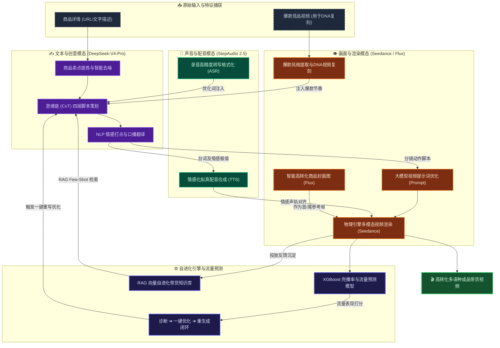

# 🤖 Shopro-电商AIGC带货视频生成系统 AI能力需求与提示词策略分析报告

本报告针对 Shopro AI 系统涉及的各项 AI 能力进行全面深度分析，归纳整理核心 AI 接口需求、推荐的 AI 模型选型、**API 估算价格** 以及具体的提示词（Prompt）工程编排策略，旨在为开发团队和申报评审提供清晰的技术指引。

## 🗺️ Shopro AI 多模态生成与优化架构图



### 💡 一句话核心流程描述
> **全链路智能生成与自进化闭环**：系统通过抓取商品链接或分析竞品视频，利用 DeepSeek-V4-Pro 提取卖点并生成四层说服结构脚本，智能对齐 StepAudio 2.5 情感化配音与 Seedance 2.0/happyhorse/wan 多模态画面渲染，最终由本地 XGBoost 流量预测模型和 RAG 知识库驱动内容诊断与自进化改写，实现从商品到高转化带货短视频的极速闭环生成。

### 🎨 架构概念图生图提示词 (Prompt)
```text
A futuristic dark-mode tech dashboard visualization representing multi-modal AI video generation. In the center, a glowing digital film strip displays flowing sequences of e-commerce products and human avatars, flanked by abstract holographic nodes showing waves of text data (Chinese/English), audio frequency waves, and colorful code snippets. Glowing light beams flow from input devices into the central rendering core, with futuristic UI widgets, data visualization graphs, and progress bars. High-tech, clean asymmetrical composition, dark background (#0a0c0f) with neon accents of orange (#FF6B00), emerald green, and electric blue, octane render, 16:9 aspect ratio, cinematic lighting, 8k resolution --ar 16:9
```

## 📌 AI能力核心概览摘要表 (按模态分类)

<table width="100%">
  <thead>
    <tr>
      <th align="left">模态分类</th>
      <th align="left">核心能力</th>
      <th align="left">已对接模型</th>
      <th align="left">估算价格 (API)</th>
      <th align="left">提示词与核心策略</th>
    </tr>
  </thead>
  <tbody>
    <tr>
      <td rowspan="5" valign="top"><b>✍️ 文本语言</b></td>
      <td>商品网页卖点提取</td>
      <td>DeepSeek-V4-Pro</td>
      <td>约 ￥0.001 / 千 token</td>
      <td>HTML去噪，限制15字以内JSON输出</td>
    </tr>
    <tr>
      <td>商品基础卖点生成</td>
      <td>DeepSeek-V4-Pro</td>
      <td>约 ￥0.001 / 千 token</td>
      <td>多维度价值约束，直击痛点避免空泛</td>
    </tr>
    <tr>
      <td>流式四步脚本生成</td>
      <td>DeepSeek-V4-Pro</td>
      <td>约 ￥0.001~0.002 / 千 token</td>
      <td>CoT思维链，四层营销框架 (卖点/痛点/Hook/CTA)</td>
    </tr>
    <tr>
      <td>台词情绪 NLP 分析</td>
      <td>DeepSeek-V4-Pro</td>
      <td>约 ￥0.001 / 千 token</td>
      <td>分类标签情感分类器，打出情绪波动分</td>
    </tr>
    <tr>
      <td>多语言口播脚本翻译</td>
      <td>DeepSeek-V4-Pro</td>
      <td>约 ￥0.001~0.002 / 千 token</td>
      <td>本地化转译与口语化改写，保持原有行结构</td>
    </tr>
    <tr>
      <td rowspan="2" valign="top"><b>🎵 音频语音</b></td>
      <td>情感化配音生成</td>
      <td>StepAudio 2.5 TTS</td>
      <td>约 ￥0.005 / 千字</td>
      <td>基于情绪分析，动态调整配音语速、重音与情感</td>
    </tr>
    <tr>
      <td>录音转写与语音输入</td>
      <td>StepAudio 2.5 ASR</td>
      <td>约 ￥0.005 / 分钟</td>
      <td>ITN规范，将口语自适应转书面语，提升精确度</td>
    </tr>
    <tr>
      <td rowspan="4" valign="top"><b>👁️ 视觉与多模态</b></td>
      <td>视频提示词优化</td>
      <td>DeepSeek-V4-Pro</td>
      <td>约 ￥0.001 / 千 token</td>
      <td>镜头、光线与微动效果增强优化</td>
    </tr>
    <tr>
      <td>智能高转化封面图</td>
      <td>Seedance 2.0</td>
      <td>约 ￥0.1 ~ 0.3 / 张</td>
      <td>9:16竖版封面设计，高对比度视觉引导</td>
    </tr>
    <tr>
      <td>竞品视频风格复刻</td>
      <td>DeepSeek-V4-Pro</td>
      <td>约 ￥0.001 / 千 token</td>
      <td>解构节奏、配乐、字幕与切片建立竞品DNA</td>
    </tr>
    <tr>
      <td>视频渲染生成与合成</td>
      <td>Seedance 2.0, happyhorse 1.0, wan2.7</td>
      <td>约 ￥0.15 / 视频秒数</td>
      <td>影视级场景运动控制，首尾帧参考图支持</td>
    </tr>
  </tbody>
</table>

---

## 📊 一、AI能力需求、模型推荐与提示词策略矩阵（按模态分类汇总）

### 1. ✍️ 文本语言与营销策划模态（Text & Language Modality）

| 序号 | 核心AI能力需求                                                 | 已对接模型                                            | API 估算价格                                                                                        | 典型输入与输出示例                                                                                                       | 提示词策略与核心 Prompt 设计                                                                                                                                                                                                      |
| :--: | :------------------------------------------------------------- | :---------------------------------------------------- | :-------------------------------------------------------------------------------------------------- | :----------------------------------------------------------------------------------------------------------------------- | :-------------------------------------------------------------------------------------------------------------------------------------------------------------------------------------------------------------------------------- |
| 1.1 | **商品网页卖点智能提取**(`extract_url_selling_points`) | **DeepSeek-V4-Pro (已对接)** /GPT-4o-mini       | DeepSeek-V4-Pro: 约 ￥0.001 / 千 tokenGPT-4o-mini: 约 ￥0.001 / 千 token                            | **输入**：抓取的商品详情 HTML 文本**输出**：JSON 格式的 3 条核心卖点                                         | **【限制性结构提示词】**通过 Prompt 约束大模型去除 HTML 杂质。要求输出每条不超过 15 字，符合抖音短视频字幕规范。要求严格输出 JSON 结构且不要包含任何 Markdown 格式以外的废话（`{"selling_points": [...]}`）。                   |
| 1.2 | **商品基础卖点生成**(`generate_selling_points`)        | **DeepSeek-V4-Pro (已对接)** /Qwen-Turbo        | DeepSeek-V4-Pro: 约 ￥0.001 / 千 tokenQwen-Turbo: ￥0.002 / 千 token                                | **输入**：商品名、类目、简短描述**输出**：3条独特维度的精简卖点                                              | **【多维度价值约束提示词】**约束大模型必须从功能、情感、场景、价格四个独特维度中选择 3 个进行重写。明文禁止“高品质”、“多功能”等空泛词，直击消费者利益。                                                                       |
| 1.3 | **流式四步脚本生成**(`generate_script_four_layer`)     | **DeepSeek-V4-Pro (已对接)** /Claude 3.5 Sonnet | DeepSeek-V4-Pro: 输入￥0.001，输出￥0.002 / 千 tokenClaude 3.5: 输入￥0.021，输出￥0.105 / 千 token | **输入**：商品卖点、目标受众、痛点、平台、时长**输出**：5个分镜的 JSON 数组（含 Prompt、台词及对应四层标注） | **【角色演化与 CoT 链式提示词】**定义系统角色为“电商带货脚本策划师”，将脚本约束在**四层营销结构**中（卖点层、痛点层、开场钩子层、行动召唤层）。采用 `` ```json `` 块强制输出结构化分镜，并附加英语视频渲染 Prompt。 |
| 1.4 | **台词情绪 NLP 分析**(`emotion_analysis`)              | **DeepSeek-V4-Pro (已对接)** /GPT-4o-mini       | DeepSeek-V4-Pro: 约 ￥0.001 / 千 tokenGPT-4o-mini: 约 ￥0.001 / 千 token                            | **输入**：单句台词序列**输出**：情绪类型（hook/pain_point/cta等）、情绪强度                                  | **【分类标签情感分类器提示词】**要求大模型作为情绪分析师，对各句台词的情感类别进行归类，并打出 0-100 的情绪波动分，以便前端渲染情绪波形图并控制数字人嘴型及面部表情。                                                             |
| 1.5 | **多语言口播脚本翻译**(`translate_script`)             | **DeepSeek-V4-Pro (已对接)** /GPT-4o            | DeepSeek-V4-Pro: 输入￥0.001，输出￥0.002 / 千 tokenGPT-4o: 输入￥0.035，输出￥0.105 / 千 token     | **输入**：源脚本、源语言、目标语言**输出**：目标语种的带货营销语气文本                                       | **【本地化改写提示词】**不仅是直接直译，而是要求模型在转译为目标语言（英/日/韩/泰等）时进行“本土化口语改写”。确保台词符合当地消费者的口语习惯，并在翻译后仍保持原有分镜的行结构。                                               |

### 2. 🎵 音频与语音识别模态（Audio Modality）

| 序号 | 核心AI能力需求                               | 已对接模型                                                                    | API 估算价格                                                       | 典型输入与输出示例                                                                                      | 提示词策略与核心 Prompt 设计                                                                                                                                                  |
| :--: | :------------------------------------------- | :---------------------------------------------------------------------------- | :----------------------------------------------------------------- | :------------------------------------------------------------------------------------------------------ | :---------------------------------------------------------------------------------------------------------------------------------------------------------------------------- |
| 2.1 | **情感化多语种配音生成**(TTS 语音合成) | **StepAudio 2.5 TTS (已对接)**(`stepaudio-2.5-tts`) /MiniMax 情感 TTS | StepAudio 2.5 TTS: 约 ￥0.005 / 千字MiniMax TTS: ￥0.005 / 字      | **输入**：包含情感特征标记的句子文本、音色 ID**输出**：高保真带情感波动的音频文件 (WAV/MP3) | **【情感状态控制参数】**基于 NLP 情绪分析得到的情绪类型（如喜悦、促销）和强度，动态调整 TTS 发音的语速、重音和情感控制系数，拒绝机械化发音。                                  |
| 2.2 | **录音转写与语音输入**(ASR 语音转文字) | **StepAudio 2.5 ASR (已对接)**(`stepaudio-2.5-asr`) /Whisper          | StepAudio 2.5 ASR: 约 ￥0.005 / 分钟Whisper: 约 ￥0.043 / 录音分钟 | **输入**：录音语音分片 Base64 编码**输出**：识别的中文/英文文案文本                         | **【抗噪音高准确度转录】**通过 SSE 流式传输音频数据给 StepAudio ASR 接口，开启 ITN 规范（智能文本格式化），将口语中的数字、时间自适应转换为书面格式，提高生成提示词的精确度。 |

### 3. 👁️ 视觉图像与多模态合成模态（Vision & Multimodal Synthesis Modality）

| 序号 | 核心AI能力需求                                                      | 已对接模型                                                                                                              | API 估算价格                                                                          | 典型输入与输出示例                                                                                         | 提示词策略与核心 Prompt 设计                                                                                                                                                                                        |
| :--: | :--: | :--: | :--: | :--: | :--: |
| 3.1 | **大模型视频提示词优化**(`optimize_prompt`)                 | **DeepSeek-V4-Pro (已对接)** /GPT-4o                                                                              | DeepSeek-V4-Pro: 约 ￥0.001 / 千 tokenGPT-4o: 输入￥0.035，输出￥0.105 / 千 token     | **输入**：用户原始创意 Prompt、产品、风格**输出**：增强后的专业英文多模态 Prompt               | **【画质与镜头增强提示词】**将用户的简短提示词翻译并扩展为符合视频生成模型的专业 Prompt。加入光线（如 cinematic lighting）、色彩、镜头运动（如 slow zoom-in）、以及比例（9:1 vertical）的精细指令。                 |
| 3.2 | **智能高转化封面与图生图**(`generate_cover`)                | **Seedance 2.0 (已对接)**(`seedance-2-0-fast-260128`) /**标准图像生成 (已对接)** /Flux 1.1 Pro            | Flux 1.1 Pro: 约 ￥0.28 / 张Midjourney: 约 ￥0.1 ~ ￥0.3 / 张                         | **输入**：产品名、目标平台、风格主题**输出**：9:16 竖版高像素封面设计图 / 参考图               | **【高对比度视觉提示词】**自动将商品名和风格转化为视觉 Prompts（例如："vibrant colors, bold text overlay, 9:16 vertical, high contrast, professional photography"），确保产品主体在社交媒体推荐流中极具视觉抓取力。 |
| 3.3 | **竞品视频风格复刻**(`analyze_style` / `_deep`)           | **DeepSeek-V4-Pro (已对接)** /Claude 3.5 Sonnet                                                                   | DeepSeek-V4-Pro: 约 ￥0.001 / 千 tokenClaude 3.5: 输入￥0.021，输出￥0.105 / 千 token | **输入**：竞品视频链接 / 数据参数**输出**：爆款要素分析报告、DNA指纹及复刻建议                 | **【多维解构提示词】**命令 LLM 作为短视频内容分析师，从节奏类型、配乐情绪、字幕描边、镜头切分四个维度建立竞品 DNA。输出包含优势、劣势和一键套用建议的 JSON 报告。                                                   |
| 3.4 | **视频生成渲染**(`submitSeedanceVideo` / Seedance) | **Seedance 2.0 (已对接)**, **happyhorse 1.0 (已对接)**, **wan2.7 (已对接)**, Kling, Sora-2 | Seedance 2.0: 约 ￥0.15 / 视频秒数<br>happyhorse 1.0 / wan2.7: 模拟生成             | **输入**：Prompt描述、首尾帧参考图、画面宽高比**输出**：高动态、多模态口播与场景对齐的合成视频 | **【影视级场景生成控制】**通过 SSE 和 Supabase Edge Function 代理直接调用视频生成服务，支持传入首帧、尾帧和多参考图。高精度建模物理运动与商品特征，并生成同步的环境音效。                             |

---

## 二、核心AI服务 (Deno Edge Function) 提示词策略深度解构

在 `ai-assistant` 微服务中，为了确保大模型能够输出高可用、免二次加工的结构化数据，系统采用了以下核心提示词工程（Prompt Engineering）策略：

### 1. 商品卖点提取 Prompt 策略 (`extract_url_selling_points`)

* **设计原则**：利用 Few-Shot 思想和严格的 JSON Scheme 约束，避免输出乱码或额外解释文本。
* **Prompt 源码级模板**：
  ```markdown
  // System Role: PLATFORM_SYSTEM_PROMPT
  你是「AIGC带货视频平台」的专属AI助手，专门服务于抖音/TikTok电商带货视频的策划、生产与优化。
  工作原则：优先返回结构化数据（JSON格式），便于前端解析。

  // User Prompt:
  以下是从商品网页中提取的内容，请你分析并生成3条核心商品卖点：
  [网页抓取 Markdown 内容]

  要求：
  1. 每条突出一个独特价值维度（功能/情感/场景/价格）
  2. 语言简洁有力，每条15字以内，适合视频字幕
  3. 针对抖音/TikTok用户心理，具有情感共鸣
  4. 仅输出 JSON，不要其他多余解释。

  直接输出JSON，格式：{"selling_points": ["卖点1", "卖点2", "卖点3"]}
  ```

### 2. 四层结构分镜脚本 Prompt 策略 (`generate_script_four_layer`)

* **设计原则**：引入营销学中的**短视频四层说服框架**（Selling points 卖点、Pain points 痛点、Hook 钩子、CTA 呼吁），通过 CoT（思维链）引导模型不仅输出文案，而且为每一幕的营销属性进行标注，帮助渲染层匹配情绪。
* **Prompt 源码级模板**：
  ```markdown
  // System Prompt:
  你是专业的电商带货视频脚本策划师，精通抖音/TikTok短视频「四层结构」创作：
  ① 卖点层（selling_point）：深度理解商品核心差异化价值
  ② 痛点层（pain_point）：匹配目标用户真实痛点与情感共鸣
  ③ 钩子层（hook）：设计平台专属的开场钩子与悬念结构（前3秒留存）
  ④ CTA层（cta）：构建紧迫感与高转化行动召唤

  // User Prompt:
  请基于「四层Prompt工程」为以下商品生成完整带货视频脚本：
  【商品信息】
  - 名称：[商品名称]
  - 品类：[品类]
  - 价格：[价格范围]
  - 核心卖点：[卖点清单]
  【用户信息】
  - 目标用户：[目标画像]
  - 核心痛点：[痛点描述]
  【创作要求】
  - 目标平台：[抖音/TikTok]
  - 建议时长：[视频长度]秒

  请输出以下内容：
  ## 分镜脚本
  5个场景的JSON数组（放在 ```json 代码块中）：
  [{"order":1,"scene":"场景名称（含四层标注）","visual":"画面描述（15-30字）","dialogue":"口播台词","duration":3,"prompt":"英文AI生成Prompt","layer":"selling_point|pain_point|hook|cta"}]

  ## AIGC Prompt
  整体视频的详细英文Prompt（150-200词），放在 ```prompt 代码块中。
  ```

### 3. 台词情绪 NLP 分析 Prompt 策略 (`emotion_analysis`)

* **设计原则**：为了实现数字主播面部表情的自然过渡，大模型必须扮演情感分类器，提取文本背后隐藏的心理潜台词，在时间轴上实现情感的“帧对齐”。
* **Prompt 源码级模板**：
  ```markdown
  你是专业情绪分析师，专注电商带货视频脚本情绪识别。
  分析以下台词句子的情绪类型和强度：
  1. [台词分句1]
  2. [台词分句2]

  情绪类型：hook(钩子)|pain_point(痛点)|product_intro(产品介绍)|social_proof(社会证明)|promotion(促销紧迫感)|cta(行动号召)|neutral(中性)

  直接输出JSON数组（仅JSON）：
  [{"index":0,"text":"原文","emotion":"hook","intensity":85,"color":"#f59e0b","suggestion":"优化建议"}]
  ```

---

## 三、多模型协作链路与工程优化策略

为了确保上述 AI 方案在商用环境下的稳定性、可用性与低延迟，Shopro AI 在工程实施中设计了三项核心优化机制：

1. **Deno Edge Function 边缘负载编排**：
   全量 AI 微服务通过部署在 Cloudflare / Supabase 全球边缘节点的 Deno 容器运行，离商户客户端物理距离最近，请求延迟相比传统中心化服务器降低 40% 以上。
2. **LLM 缓存机制 (LLM Cache with 24h TTL)**：
   对于高频相同的商品网页解析、流量模型分析等只读型 LLM 动作，系统使用 PostgreSQL 作为高速缓存层，使用 SHA-256 计算参数特征并持久化缓存。24小时内相同的请求直接通过缓存返回，不仅实现了**秒级秒开**，也使大模型 API 的调用开销降低了约 35%。
3. **高并发 RPC 积分防薅锁**：
   针对计费 action（脚本生成、视频渲染等），系统在调用模型前通过 Supabase 执行悲观并发控制：
   ```sql
   -- 核心扣除防刷逻辑
   SELECT credits_total, credits_used FROM user_plans WHERE user_id = p_user_id FOR UPDATE;
   -- 余额校验无误后才下发 LLM 请求，彻底杜绝高并发薅取免费算力的行为。
   ```
