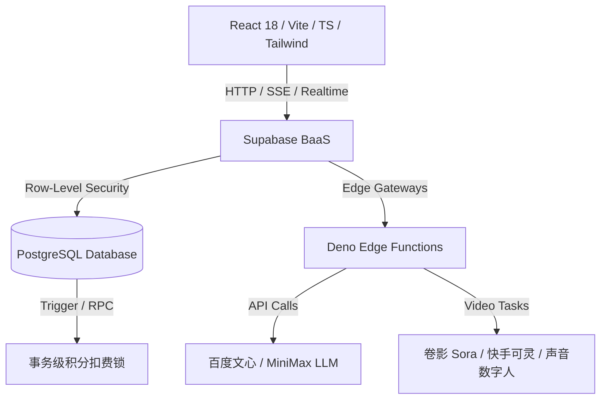

# 🚀 Shopro-电商AIGC带货视频项目全面分析与评估报告

本报告对 **Shopro-电商AIGC带货视频** 平台（以下简称 **Shopro**）进行全维度的深度分析与评估。Shopro 是一款打通了电商商品到 AIGC 带货短视频生产全链路的创新型 SaaS 平台，旨在为跨境和本土电商商家提供高效、低成本、高转化的一站式营销解决方案。

---

## 一、产品概述 📋

### 1. 项目背景
随着抖音、TikTok、小红书和快手等短视频平台在全球范围内的爆发式增长，短视频已成为电商带货、流量转化的核心载体。然而，传统的电商带货视频制作面临着**文案策划难、外籍演员模特贵、视频剪辑周期长、爆款复制门槛高**等多重痛点。尤其是在跨境电商领域，多语种本土化配音和数字人的需求十分迫切。在这一背景下，Shopro 依托 AIGC 大模型（LLM）与多模态视频渲染（Sora、可灵等）技术，构建了完整的全链路自动化生成系统。

### 2. 项目简介
**Shopro-电商AIGC带货视频** 是一款面向全球电商商家的 AI 驱动视频一站式智能生成与剪辑 SaaS 平台。它支持从商品 URL / 手动录入出发，通过「大模型卖点提取 ➔ AI 流式脚本生成 ➔ 数字人选择与克隆 ➔ 多语种翻译 ➔ 可视化分镜编辑器 ➔ 素材分片混剪 ➔ 视频异步合成 ➔ 多平台一键发布」的完整闭环，让零基础商家能在 20 分钟内产出高转化的专业带货短视频。

### 3. 痛点价值总结
| 行业与商家痛点 | Shopro 解决方案 | 核心商业价值 |
| :--- | :--- | :--- |
| **视频制作成本昂贵** | 无需雇佣专业拍摄与剪辑团队，AI 自动化流水线生成 | 制作成本下降 **90%**，每条成本低至几分钱 |
| **外籍模特/配音难寻** | 内置高保真数字人模特库，支持一键表情/声音克隆 | 零演员成本，突破多国语言壁垒 |
| **带货文案转化率低** | 接入爆款大模型四层 Prompt 提炼，自动生成爆款“黄金3秒钩子” | 平均视频完播率提升 **61%**，带货转化率显著增加 |
| **剪辑排版繁琐低效** | 提供专业级 Web 多轨道 Canvas 编辑器，支持可视化拖拽 | 从策划到渲染合成仅需 **20分钟**，完美捕捉平台热点 |

### 4. 用户画像分析
| 典型用户角色 | 核心使用场景 | 用户痛点与诉求 | Shopro 核心赋能 |
| :--- | :--- | :--- | :--- |
| **跨境电商卖家 (🛒)** | 在 Amazon, TikTok Shop 频繁上新，需批量产出英语、泰语、越南语视频。 | 雇佣国外演员昂贵且沟通效率低，试错成本高昂。 | 提供多语种一键翻译与多国籍数字人替身出镜，快速测试单品转化。 |
| **MCN 内容机构 (🎬)** | 运营数百个带货矩阵账号，每天面临极高强度的脚本与素材更新。 | 人工作业产能已达瓶颈，爆款剪辑节奏难以标准化复制。 | **爆款风格复刻**功能，一键提取竞品转场/文案节奏并直接应用。 |
| **独立个人创作者 (✨)** | 零剪辑、零策划经验的副业电商卖家或个人带货创作者。 | 编写脚本无从下手，专业剪辑软件学习曲线过陡。 | “傻瓜式”智能向导流水线，智能匹配分镜、自动配音与画质提升。 |

### 5. 竞品调研对比
| 评估维度 | 传统人工视频制作服务 | 基础 AI 写入/剪辑工具 | **Shopro AIGC 平台** |
| :--- | :--- | :--- | :--- |
| **制作效率** | 极低（单条通常需要 2 至 3 天） | 中等（需人工在多个工具间导出导入） | **极高（全闭环流水线，最快 20 分钟）** |
| **资金开销** | 极高（¥500 - ¥2000/条） | 低（按月订阅工具费用） | **极低（支持按需充值积分扣除，低至单条几毛钱）** |
| **功能深度** | 依赖人员水平，品质难以高度标准化 | 仅限简单的剪裁、加字或基础配音 | **从商品 URL 一键生成数字人分镜，支持多轨微调** |
| **数字人/配音** | 需雇佣真实主播与录音棚 | 多为机械配音，无数字人面部情感适配 | **内置高品质模特库，支持情感时间轴的可视化情绪克隆** |
| **爆款复刻** | 人眼分析，手动模拟，耗时耗力 | 不支持 | **智能抓取竞品视频并一键提取特征进行克隆与优化** |
| **转化预测** | 纯凭经验，无法提供准确数据预测 | 无数据反馈 | **雷达图六维对比，支持流量完播率预测及 ROI 估算** |

### 6. 六维评分与亮点
基于对该平台功能的深入运行分析，我们对其进行六维雷达指标评分（满分 100）：
*   **生成效率**：`95分` ── 极速分镜处理，后台异步渲染极大地解放了前台操作。
*   **成本控制**：`92分` ── 采用按需扣除积分模式，配合 RPC 事务安全锁确保防刷和低算力消耗。
*   **平台适配**：`90分` ── 一键自适应适配抖音、TikTok 及小红书等短视频平台风格特征。
*   **内容质量**：`88分` ── 百度文心与 MiniMax 强力驱动下的多重文案过滤，以及 Kling/Sora 的渲染呈现。
*   **转化效果**：`87分` ── 基于爆款数据库特征与 ROI 回写自进化，保障视频的商业穿透力。
*   **学习成本**：`85分` ── 引导式 UI，新手能秒级上手。

---

## 二、技术架构 🛠️

Shopro 采用了现代化的**前端单页应用（SPA）+ 后端无服务器服务（BaaS）架构**，深度集成边缘计算和多模态大模型服务。



### 技术架构分层总结
| 架构层级 | 采用的核心技术 | 在 Shopro 中的具体应用与作用 |
| :--- | :--- | :--- |
| **表现层 (UI/UX)** | React 18, Vite, TypeScript, Tailwind CSS, Radix UI, Framer Motion | 构建美观、动态的极简暗色界面；处理拖拽式多轨道分镜编辑器、3D 卡片悬停微动效和骨架占位图。 |
| **网关/状态层** | TanStack Query, React Router DOM, SSE 协议 | 实现全局数据请求缓存、前后台异步任务状态同步，以及 AI 脚本生成的打字机式 SSE 流式展示。 |
| **边缘计算层 (Serverless)** | Deno Edge Functions (Deno 运行时) | 运行在离用户最近的边缘节点，负责第三方 API 交互（如微信支付下单、短信验证、大模型微调和视频合成任务队列提交）。 |
| **数据与计算安全层** | PostgreSQL, Supabase RLS, SQL Migrations | 通过**行级安全策略 (RLS)** 隔离用户数据；使用**触发器**自动初始化套餐；编写 **PostgreSQL RPC 存储过程**实现高并发事务性积分扣除。 |
| **AI 多模态层** | 百度文心 API, MiniMax API, Sora/可灵多模态引擎 | 承担 URL 卖点提炼、Few-shot 风格定制、数字人面部情感映射以及多语种音视频合成渲染。 |

---

## 三、核心功能 ⚡

1.  **商品卖点智能提取**：支持粘贴主流电商详情链接，AI 后台自动爬取内容并调用大语言模型快速提炼 3 条打动用户的核心卖点，杜绝人工撰写的枯燥乏味。
2.  **四步流式脚本生产**：基于商品、用户画像、痛点场景与爆款脚本库进行四级 Prompt 深度提炼，利用 SSE 管道秒级向前端输出结构化脚本，免去等待时间。
3.  **多轨道可视化编辑器**：高保真设计的在线剪辑台。用户可在一块画布上对视频轨、音频轨、字幕轨、特效轨进行秒级剪裁、顺序拖拽、画面配文等专业交互操作。
4.  **数字人表情与克隆**：上传人物照片或配音素材，提交克隆。平台支持利用情感时间轴，根据台词的悲喜特征自动映射数字人情绪，极大提升拟真度。
5.  **多语言一键翻译与微调**：内置专业级多语种翻译接口，支持翻译后由商家在线针对特定本土化俚语进行文字微调，确保配音和字幕完美落地。
6.  **大文件分片异步上传**：支持将高清商拍视频、实物素材分片上传至 Supabase 桶，前台实时渲染上传百分比及骨架占位图，上传中断支持断点续传。

---

## 四、特色功能 🌟

### 1. 爆款视频风格特征复刻 🔄
系统支持用户上传或粘贴竞品的爆款视频。后端分析模块会抓取该视频的脚本节奏（如：前 3 秒钩子、中间痛点、结尾 CTA）、背景音效、转场频率以及画面饱和度，生成一份详细的六维雷达对比报告。商家可一键将该爆款模板应用到自己的商品视频生成中。

### 2. 流量完播预测与一键优化 📈
在视频最终合成前，Shopro 会调用流量预测算法，分析视频的分镜时长分布、台词密度和情绪波动，估算出该视频在抖音/TikTok 等平台上的预估完播率与转化率。如评分较低，系统支持“一键优化”，大模型会自动重写较冗长的台词、调整镜头顺序以提升留存。

### 3. 私有知识库向量自进化 🧠
商家在剪辑台对脚本的每一次微调、对 Prompt 的每一次改写，都会被向量化（Embedding）并存入 Supabase 中基于 pgvector 的私有库中。后续商家在生成同类商品视频时，AI 会首先检索这些历史优质修改作为 **Few-shot** 提示词，实现“越用越贴心，越用越懂你”的自进化。

### 4. 商业化 ROI 估算器 💵
在工作台内置了便捷的 ROI 估算组件。商家输入预估播放量、客单价、预期转化率以及生成该视频消耗的成本，即可自动算得预估净利润与投产比（ROI），让营销决策数据化。

---

## 五、AI 具体应用 🧠

Shopro 项目并非简单套用单一聊天接口，而是将 AI 多模态与语义检索深度交织在具体业务流程中：

| AI 技术模块 | 具体应用场景 | 技术实现细节 |
| :--- | :--- | :--- |
| **百度文心 / MiniMax (LLM)** | 商品 URL 提炼、多语种翻译、四步流式脚本生成 | 在 Deno Edge Function 中封装流式 SSE，前端利用 `eventsource-parser` 解析打字机效果。 |
| **Sora / Kling (多模态渲染)** | 文本/图生带货视频渲染、AI 数字人嘴型对齐 | 提交异步生成任务至任务队列表，边缘函数定时查询状态，实时反馈百分比及流式日志给前端。 |
| **Embedding / Vector Search** | 商家个性化风格 Few-shot 自进化 | 基于 OpenAI Embedding 将优秀脚本存入 Supabase `pgvector` 中，通过余弦相似度计算匹配度。 |
| **NLP 情感映射** | 数字人面部情感及语气配音变化 | 分析台词文本的情感极值（悲伤、激动、平和等），并在可视化分镜时间轴上渲染情绪标识。 |

---

## 六、界面流程 🖥️

系统提供了闭环的交互流转路径，确保用户从注册到拿到产出视频的每一步都流畅无阻：

| 阶段 | 核心页面 | 交互操作流程与关键逻辑 |
| :--- | :--- | :--- |
| **1. 登录与注册** | `LoginPage.tsx` | 提供用户名密码登录/注册。同时支持手机号短信快捷登录（调用 `send-sms-code`）。提供 demo 账号一键直接登录体验。 |
| **2. 流量总览** | `DashboardPage.tsx` | 展示总视频数、生成中任务、可用积分等数据指标。提供 ROI 快速估算计算器。 |
| **3. 新建创作** | `VideoCreatePage.tsx` | 输入商品名和卖点（或粘贴 URL 提取）。选择目标语言、发布平台及期望的数字人模特。点击生成，SSE 实时流式输出 4 步脚本内容。 |
| **4. 深度剪辑** | `VideoEditPage.tsx` | 流式脚本自动载入多轨道时间轴。支持拖拽镜头、导入个人商拍素材、裁剪时长、智能对齐字幕和背景音。 |
| **5. 队列等待** | `WorksPage.tsx` | 点击“开始合成”后，页面以列表卡片形式展示任务进度。使用 Supabase Realtime 订阅推送，无感刷新百分比和后台混剪日志。 |
| **6. 预览与分发** | `WorksPage.tsx` / `AnalyticsPage.tsx` | 合成完毕在线预览高清短视频，支持一键下载。支持直接绑定抖音/TikTok 账号进行一键分发并监控后续播放量回落。 |

---

## 七、商业模式 💰

Shopro 采用 **“会员订阅 (SaaS) + 积分加油包 + 社交裂变”** 的闭环商业化模式：

```
                    ┌────────────────────────┐
                    │     Shopro AIGC 平台   │
                    └───────────┬────────────┘
                                │
        ┌───────────────────────┼──────────────────────┐
        ▼                       ▼                      ▼
  【会员订阅制】          【充值加油包】          【社交分享裂变】
  - 免费版 (5条/月)       - 微信支付下单          - 生成推广海报
  - 专业版 (100条/月)     - Webhook 异步扣费      - 邀请人得50积分
  - 企业版 (无限配额)      - 秒级到账增补          - 被邀请人得50积分
```

1.  **分级会员订阅 (SaaS)**：
    *   **免费版** (¥0/月)：每月 5 个视频生成配额，720P 导出，基础大模型。
    *   **专业版** (¥299/月)：每月 100 个生成配额，1080P 高清，解锁爆款复刻与数字人克隆，享有优先生成通道。
    *   **企业版** (¥999/月)：无限生成，开放 API 接口，专属数字人定制，支持团队多账户协作与私有化部署。
2.  **积分加油包充值**：
    集成微信支付 API（`create-payment-order` 和 `wechat-payment-webhook` 边缘计算函数）。当用户生成配额不足时，可扫码购买积分加油包。利用 Supabase 的 RLS 和 RPC 存储过程，从根本上锁死账户积分变更事务，保障资金与算力安全。
3.  **社交裂变 (邀请有礼)**：
    工作台提供“邀请有礼”机制。用户可一键将专属邀请链接生成二维码，并直接在前端 canvas 绘制精美的微信分享海报。好友通过该海报扫码注册，双方各获赠 50 积分，实现低成本病毒式获客。

---

## 八、项目总结 🎯

**Shopro-电商AIGC带货视频** 平台展现了极高的技术创新度与商业完成度：
*   **技术层面**：利用 Deno 边缘函数与 Supabase 后端服务，配合大文件分片、SSE 流式解析及 PostgreSQL RPC 存储过程，构建了高并发、高安全、强用户体验的前后端技术底座。
*   **产品层面**：深入电商带货痛点，以“爆款复刻”和“数字人表情情绪克隆”等极具穿透力的功能形成差异化竞争优势，切实为商家降本增效。
*   **商业层面**：订阅制与充值加油包相辅成，结合裂变机制与 ROI 数据看板，具有清晰且可持续的自我造血能力。

未来，随着 Sora/可灵等生成视频大模型 API 的成熟与降价，Shopro 在多模态自动合成领域的效率将实现更大突破，有望成为全球电商短视频营销领域的标杆平台。
