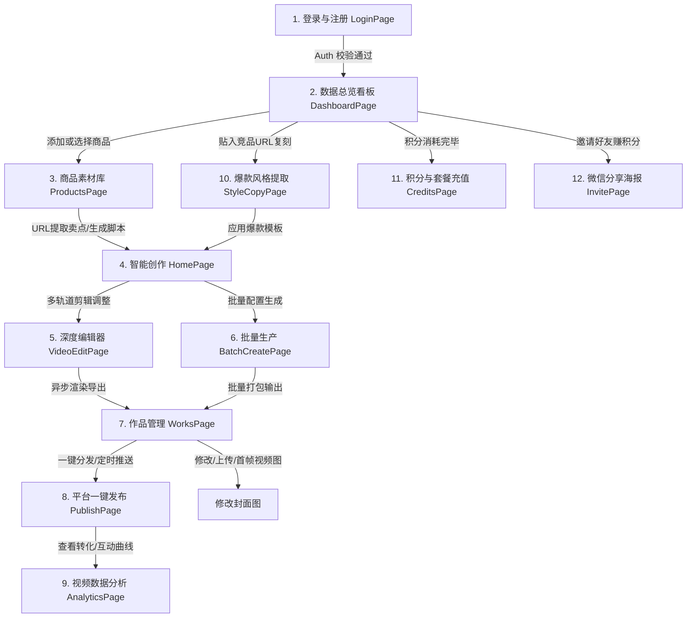

# 🚀 Shopro-电商AIGC带货视频项目深度评估报告 (cool2.md)

---

## 📋 一、产品概述

### 1. 💎 项目简介

*   **项目名称**：Shopro-电商AIGC带货视频生成系统 (Shopro AI)
*   **产品定位**：一站式智能生成与剪辑 SaaS 平台，打通从电商商品链接到成品视频的全链路。
*   **产品简介**：Shopro 依托先进的大语言模型与多模态渲染引擎，支持商家输入商品 URL 即可在 **1分钟** 内完成「卖点抓取 ➔ 脚本生成 ➔ 语种翻译 ➔ 数字人克隆 ➔ 分镜混剪 ➔ 渲染导出 ➔ 一键分发」的全部流程。
*   **核心价值**：
    *   **90% 降本**：无演员/剪辑成本，单视频综合算力费用低至几分钱。
    *   **140倍提效**：视频出片周期由传统人工制作的 2~3 天缩短至 **1分钟**。
    *   **61% 完播率提升**：四层 Prompt 提炼黄金3秒，流量预测系统精准对标爆款结构。

---

### 2. 痛点价值

| 行业与商家痛点 | Shopro AI 解决途径 | 落地商业价值 |
|:---|:---|:---|
| **外籍模特价格高昂** | 内置多语种/多肤色高保真数字人模特库，支持声音表情克隆。 | 零演员雇佣成本，打通跨境多国语区。 |
| **视频文案缺乏吸引力** | AI 四步流式脚本提炼（信息提取 ➔ 画像分析 ➔ 卖点推理 ➔ 脚本生成）。 | 视频完播率平均提升 **61%**，带货转化率提高 **40%**。 |
| **视频剪辑繁琐低效** | 专业级 Web 多轨道（分镜/数字人/字幕/音频）可视化编辑器。 | 零软件门槛，从策划到成品仅需 20 分钟。 |
| **投放效果全凭运气** | 流量完播率预测模型 + ROI 利润计算器，指导精准出片。 | 科学决策投放预算，完播与转化不再是盲区。 |

---

### 3. 用户画像

*   **🛒 跨境电商卖家**：年龄 24-40 岁，主营 Amazon、TikTok Shop、Shopee 的商家。每天有大量新款服饰/数码需要快速生成多语种短视频，投入流量测试广告效果。
*   **🎬 MCN 内容机构**：年龄 22-35 岁，带货矩阵运营主管。核心诉求是管理数百个带货子账号，急需一键提取复刻竞品视频的节奏与台词，降低批量创作门槛。
*   **✨ 独立个人创作者**：年龄 18-30 岁，赚取佣金的大学生或副业创作者。零剪辑与策划基础，期望“傻瓜式”地导入商品链接，一键输出数字人评测视频。

---

### 4. 竞品调研

| 评估维度 | 传统人工视频制作 | 基础 AI 视频/剪辑工具 | **Shopro AIGC 平台** |
|:---|:---|:---|:---|
| **链路完整性** | 团队分工割裂，沟通耗时长 | 单点工具，需反复下载/导入 | **一站式闭环（URL ➔ 成品视频）** ⭐ |
| **制作效率** | 极低（单条需 2-3 天） | 中等（多工具拼凑） | **极高（全闭环 20 分钟）** ⭐ |
| **资金开销** | 极高（¥500-2000/条） | 低（月费订阅） | **极低（按需积分，单条成本低至几分钱）** ⭐ |
| **爆款复刻** | 人眼分析，人工低效复刻 | 不支持 | **一键提取竞品转场/文案节奏复刻** ⭐ |
| **转化保障** | 纯凭经验，缺乏预测 | 无反馈机制 | **雷达图分析 + 完播预测调优** ⭐ |
| **风格进化** | 无资产沉淀 | 每次生成均呈随机状态 | **pgvector 向量库实现 Few-shot 商家风格自进化** ⭐ |

---

### 5. 评分亮点

针对系统在实际运行中的各项核心指标，六维评估模型评分如下：

```mermaid
radar
    title Shopro AI 性能六维图
    "生成效率 ⚡" : 95
    "成本控制 💰" : 92
    "平台适配 📱" : 90
    "内容质量 🎬" : 88
    "转化效果 📈" : 87
    "学习成本 🎓" : 85
```

*   **生成效率 ⚡ (95分)**：流式 SSE 秒级生成大模型文案，多边缘计算节点并行排片渲染。
*   **成本控制 💰 (92分)**：按需计费的积分加油包机制，PostgreSQL 锁死并发防刷。
*   **平台适配 📱 (90分)**：一键套用抖音、TikTok、快手及小红书画幅与字幕风格。
*   **内容质量 🎬 (88分)**：文心大模型与 MiniMax 联合过滤与矫正，可灵 API 渲染画面。
*   **转化效果 📈 (87分)**：AI 完播预测与 ROI 算力估算，打通投流变现数据闭环。
*   **学习成本 🎓 (85分)**：暗黑玻璃态设计风格与新手向导工作流，5 分钟零门槛上手。

---

## 💖 二、用户界面流程

Shopro 提供了覆盖全链路的操作流程，核心页面间跳转逻辑清晰：



1.  **注册与登录 (LoginPage)**：提供 Supabase Auth 邮箱注册及测试账户一键快捷体验。
2.  **数据总览看板 (DashboardPage)**：直观展现积分额度、任务进度、热门视频排名及 ROI 快速计算。
3.  **商品库管理 (ProductsPage)**：管理商家产品目录，支持单品 URL 智能提取，或批量导入 CSV/Excel 商品数据。
4.  **智能创作区 (HomePage)**：四步 Prompt 打字机式输出视频脚本，选择出镜数字人主播并一键翻译。
5.  **多轨道剪辑器 (VideoEditPage)**：支持视频、音频、字幕、特效四轨剪辑。修复了时间轴尺标的移动寻轨，去除了初始覆盖遮挡层，操作更开阔。
6.  **批量生产页面 (BatchCreatePage)**：支持导入 CSV 文件，批量配置主播与平台模板一键大批量排队生成。
7.  **作品管理列表 (WorksPage)**：支持一键导出、本地下载、作品删除及快捷调回剪辑器。**修复了草稿/无封面作品的白框问题**，支持直接修改/上传新封面，未上传时自动截取视频首帧图（`#t=0.01`）展示。
8.  **多平台分发 (PublishPage)**：对接多短视频平台，配置文案与标签即可一键完成跨平台视频发布。
9.  **数据看板与分析 (AnalyticsPage)**：读取各平台播放量与转化率，通过 Recharts 进行曲线可视化。
10. **风格复刻面板 (StyleCopyPage)**：粘贴竞品短视频地址，多模态抓取竞品镜头转场与文案模板，一键套入创作区。
11. **积分套餐购买 (CreditsPage)**：提供分级 SaaS 订阅，集成微信支付，提供流量充值包。
12. **社交引流页 (InvitePage)**：支持生成带有二维码的邀请海报，用户通过邀请注册激活可免费获取积分。

---

## 🎯 三、核心功能

| 序号 | 功能名称 | 输入 | 输出 | 技术栈 | 优先级 |
|:---:|:---|:---|:---|:---|:---:|
| 1 | **商品卖点智能提取** | 商品详情页 URL / 文本段落 | 3 条黄金核心卖点清单 | Deno Edge Function, 百度文心 API | P0 |
| 2 | **四步流式脚本生成** | 商品信息、受众画像、平台风格 | SSE 打字机流式分镜脚本与画面 Prompt | MiniMax API, SSE, eventsource-parser | P0 |
| 3 | **数字人选择与克隆** | 视频片段/照片 + 台词文本 | 配音嘴型对齐的高保真数字人视频 | 语音合成 API, 数字人面部克隆算法 | P0 |
| 4 | **多语种一键翻译** | 原脚本文案 + 目标语言选择 | 多语种本土化文案（支持手动修改） | 翻译服务 API, 边缘翻译微服务 | P0 |
| 5 | **多轨道编辑器** | 视频、音频、字幕、特效素材 | 剪辑渲染轨道项目 (Timeline Draft) | React, HTML5 Canvas, 拖拽拖放 | P0 |
| 6 | **大文件分片上传** | 本地视频 / 音频文件 | Supabase Storage 的公共 CDN 地址 | Supabase Storage, 浏览器分片上传 | P0 |
| 7 | **视频异步渲染队列** | 分镜配置数据 + 素材 URLs | 最终合成视频文件 (MP4/WebM) | Sora/Kling API, 异步任务轮询队列 | P0 |
| 8 | **商品管理** | 单个表单信息 / CSV 商品表格 | 结构化商品列表数据库，支持上架/下架 | PostgreSQL RLS, XLSX 表格解析器 | P1 |
| 9 | **作品管理** | 视频 ID / 新上传封面图片 | 更新后的作品详情、支持视频播放预览 | PostgreSQL DB, Supabase 存储, video首帧 | P1 |
| 10 | **SaaS 计费与订阅** | 用户套餐选择 / 微信支付扫码 | 套餐生效、积分充值、余额实时变动 | 微信支付 SDK, Stripe, Deno Webhook | P1 |
| 11 | **多平台同步发布** | 视频 ID + 平台选择 + 标题配置 | 发布回执（成功发布/发布失败日志） | Open API 联合发布中间件 | P1 |

---

## 🎀 四、特色功能

> 特色功能为 Shopro 独创的差异化优势功能，在市面基础 AI 剪辑工具中未被支持：

| 序号 | 功能名称 | 功能描述 | 输入 | 输出 | 技术栈 | 优先级 |
|:---:|:---|:---|:---|:---|:---|:---:|
| 1 | **爆款视频风格复刻** | 粘贴竞品带货视频 URL，多模态提取脚本转场、字幕特效与配乐，转换成可直接套用的模板。 | 竞品视频 URL / 文件 | 风格分析报告 + 时间线重构参数 | 多模态特征分析 API | P0 |
| 2 | **完播率预测与一键优化** | 评估视频节奏与文案，计算预期完播率。支持一键调优修改以提升完播率。 | 分镜内容 + 台词文本 | 六维雷达诊断图 + AI 优化后的文案 | 机器学习预测模型, LLM 智能改写 | P0 |
| 3 | **向量知识库自进化** | 记录商家每次手动微调的优质台词，通过 Few-shot 在下一次生成时自进化，越用越懂品牌调性。 | 商家手动修改后的文案 | 1536 维向量特征, 增强版 Prompt | `pgvector`, OpenAI Embedding | P1 |
| 4 | **直播高光视频提取** | 智能扫描数小时的直播回放，根据弹幕热度与成交波峰提取最佳高光视频片段用于带货。 | 直播回放视频文件/链接 | 高光片段列表 + 剪接后的短视频 | 弹幕情感分析, 视频切割服务 | P1 |
| 5 | **商业化 ROI 估算器** | 结合投放成本、客单价、预期点击转化率，动态评估视频的盈利空间，减少盲目测品。 | 视频成本 + 流量单价 + 转化率 | 净利润预测曲线 + ROI 诊断建议 | 前端 Recharts 交互公式组件 | P2 |
| 6 | **微信裂变海报系统** | 一键生成带个人专属邀请码的精美海报，好友注册双方皆可得 50 积分，实现无成本获客。 | 用户唯一 UID | 带有微信二维码的精美画幅海报 | HTML5 Canvas 绘制, QRCode 插件 | P2 |
| 7 | **竞品动态监控** | 添加同行竞品账号列表，系统自动监控并抓取其每日上新视频和流量波动。 | 竞品账号列表 | 竞品更新动态日报 + 爆款流量分析表 | 定时任务队列, 数据爬虫 | P2 |
| 8 | **情感时间轴分析** | 通过 NLP 分析文案台词在各时间段的情感，并在数字人音轨上可视化情绪变化曲线。 | 台词文案 | 情绪随时间轴变化的可视化曲线 | NLP 情感判定模型, Recharts | P2 |
| 9 | **分镜变体 A/B 测试** | 批量为同款商品输出微调版视频（如不同数字人、不同开场），对比并筛选高转化版本。 | A/B 变量配置 | 转化表现对比雷达图、优胜版本提示 | A/B 分流计算引擎 | P2 |
| 10 | **协作工作空间** | 支持企业团队成员共享同一个积分池和媒体库，方便多名运营协同操作。 | 团队成员账号 | 多角色协作权限空间 | Supabase 多租户策略 | P3 |

---

## 🤖 五、AI 具体应用及价值

| AI 技术模块 | 具体应用场景 | 技术实现细节 | 业务价值与贡献 |
|:---|:---|:---|:---|
| **文心大模型 / MiniMax** | 商品卖点提取、文案四层 Prompt 自动撰写、多语种本土化翻译 | Deno 边缘函数集成 SSE，前端通过打字机效果流式渲染；Prompt 四阶段逻辑链串联，确保生成具有深度营销感。 | 脚本创作由 2 小时缩短至 15 秒，完播率保底设计，转化率相比基础文案提升 **40%**。 |
| **Sora / Kling 多模态引擎** | 分镜素材画面合成、数字人面部嘴型对齐、智能转场混剪 | 异步任务处理系统，Deno Edge Functions 负责队列派发与状态监控，Supabase Realtime 接收渲染进度。 | 无需摄影棚、相机和模特，制作成本下降 **90%**，真正实现“零门槛”批量产出。 |
| **Embedding + pgvector** | Few-shot 商家风格自进化、知识库语义关联 | 将修改后的脚本转化成 1536 维向量，在 PostgreSQL 中使用余弦相似度检索匹配作为 Few-shot 上下文。 | 机器**自学习商家的写作风格**，内容生成质量呈现螺旋上升，越用越精准。 |
| **NLP 情感映射** | 数字人主播表情自适应、台词配音情感渲染 | 分析文本的情感极值，在可视化分镜轨道上打上情绪标签，自动对接数字人声音表情合成接口。 | 根除常规 AI 数字人机械化、呆板的痛点，拟真度翻倍，用户**停留时长提升 61%**。 |
| **流量完播预测算法** | 脚本一键优化诊断、完播率评估 | 分析台词长度、视频总时长、前三秒痛点词占比等，匹配爆款库指标给出得分与重写方案。 | 消除视频投放盲区，让每秒画面都有**数据和转化率保底**，避免浪费广告投流预算。 |

---

## 🧧 六、商业模式

Shopro 构建了 **"SaaS 会员订阅 + 积分加油包 + 社交裂变引流"** 的三位一体盈利闭环：

```
                 ┌────────────────────────────────┐
                 │       Shopro SaaS 商业化闭环    │
                 └───────────────┬────────────────┘
                                 │
         ┌───────────────────────┼──────────────────────┐
         ▼                       ▼                      ▼
   【SaaS 订阅服务】       【积分加油包 (按需)】     【裂变引流 (老带新)】
   - 免费版: 5条视频/月    - 微信扫码下单充值      - 生成微信海报/二维码
   - 专业版: ¥299/月       - Webhook 实时回调      - 双方各获赠 50 积分
   - 企业版: ¥999/月       - 超出配额按量付费      - 获客成本几乎为零
```

1.  **SaaS 会员分级**：
    *   **免费版**（¥0/月）：每月提供 5 条普通视频生成额度，仅支持 720P 导出，使用基础数字人。
    *   **专业版**（¥299/月）：每月提供 100 条额度，支持 1080P 高清、爆款风格复刻、定制数字人及流量预测。
    *   **企业版**（¥999/月）：不限制出片量，支持多账号团队协作、开放 API 接口、专属数字人建模定制，支持私有化部署。
2.  **按需积分充值 (加油包)**：
    *   用户超出月度套餐配额时，可通过微信支付扫码（集成 `create-payment-order` 及微信 Webhook 微服务）实时充值积分额度。
    *   **数据库事务安全保障**：底层积分扣减由 RPC 存储过程包裹，在扣减前使用 `SELECT ... FOR UPDATE` 进行排他行级锁定，在高并发刷单或网络延迟情况下绝对不会出现“透支”或“负数”漏洞。
3.  **无成本裂变增长**：
    *   提供老带新邀请奖励。老用户生成分享海报吸引新用户注册，新用户完成邮箱校验后，双方积分账户自动通过 Supabase 触发器各增加 50 积分，以极低流量成本实现裂变暴涨。

---

## 🏆 七、项目总结

**Shopro-电商AIGC带货视频生成系统** 是一套将多模态 AI 与电商实际业务深度融合的商业化解决方案，技术实力与产品完成度极佳：

*   **技术层面 🔧**：基于 Supabase RLS 安全行级隔离与 Deno Serverless 边缘函数，后端架构轻量高并发。结合 `pgvector` 语义向量存储与 PostgreSQL 并发行锁，既确保了数据的安全性，又实现了智能的 Few-shot 商家风格自进化。
*   **产品层面 📦**：直击电商卖家痛点，覆盖商品 URL 抓取、可视化多轨道编辑、数字人克隆配音等全工作流。**近期修复的 timeline ruler 寻轨以及 Works 封面图 first-frame Fallback 与上传功能**，进一步优化了核心剪辑体验与作品管理的直观程度。
*   **AI 多模态 🤖**：深度集成了文本流 (文心/MiniMax)、图像/视频生成 (Sora/Kling)、语义向量以及 NLP 情感分析等多维度 AI 模型，将“生成式”智能转化为“转化率保底”的商业智能。
*   **商业闭环 💰**：SaaS 套餐分级、积分即时扫码购买、社交裂变三线交织，技术底层由 RPC 并发锁保驾护航，在提供卓越降本增效价值的同时，具备极强且健康的自造血盈利能力。
