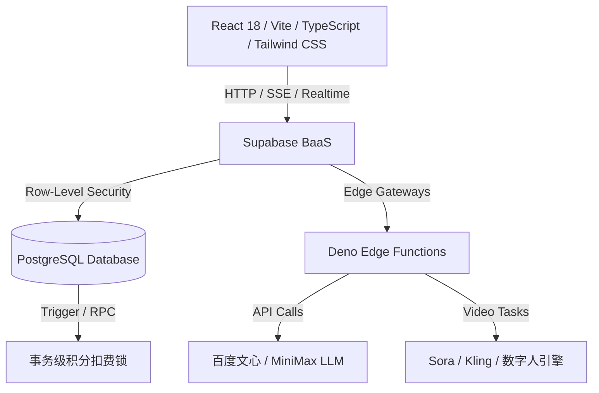

# 🚀 Shopro-电商AIGC带货视频项目全面分析与评估报告

本报告对 **Shopro-电商AIGC带货视频生成系统**（以下简称 **Shopro**）进行全维度的深度分析与评估。Shopro 是一款打通了电商商品到 AIGC 带货短视频生产全链路的创新型 SaaS 平台，旨在为跨境和本土电商商家提供高效、低成本、高转化的一站式营销解决方案。

---

## 📋 一、产品概述

### 1. 项目背景

随着抖音、TikTok、小红书和快手等短视频平台在全球范围内的爆发式增长，短视频已成为电商带货、流量转化的核心载体。然而，传统的电商带货视频制作面临着多重痛点：

| 序号 | 行业痛点 | 具体表现 |
|:---:|:---|:---|
| 1 | **文案策划难** | 商家缺乏专业营销文案能力，带货脚本转化率低，无法提炼"黄金3秒钩子" |
| 2 | **外籍演员贵** | 跨境电商需多语种本土化模特，雇佣外籍演员成本极高（¥500-¥2000/条） |
| 3 | **剪辑周期长** | 传统策划、拍摄、配音及剪辑通常耗时2-3天，完全跟不上平台流量热点 |
| 4 | **爆款复制难** | 竞品爆款视频风格难以系统化提取与复刻，人工模拟耗时耗力 |
| 5 | **多语种壁垒** | 跨境出海面临多国语言障碍，小商家难以低成本适配全球市场 |
| 6 | **数据盲区** | 无法预测视频流量表现，投放策略全凭经验，缺乏数据化决策支撑 |

在这一背景下，Shopro 依托 AIGC 大模型（LLM）与多模态视频渲染（Sora、可灵等）技术，构建了完整的全链路自动化生成系统。

### 2. 项目简介

| 维度 | 内容 |
|:---|:---|
| **项目名称** | Shopro-电商AIGC带货视频生成系统 |
| **产品定位** | 面向全球电商商家的 AI 驱动带货视频一站式智能生成与剪辑 SaaS 平台 |
| **产品口号** | AI 全流程辅助，从商品详情页链接到高转化带货视频只需 20 分钟 |
| **核心简介** | 支持从商品 URL / 手动录入出发，通过「大模型卖点提取 → AI 流式脚本生成 → 数字人选择与克隆 → 多语种翻译 → 可视化分镜编辑器 → 素材分片混剪 → 视频异步合成 → 多平台一键发布」的完整闭环，让零基础商家极速产出专业带货短视频 |
| **核心价值** | 制作成本下降 **90%**，单视频成本低至几分钱；从策划到渲染仅需 **20分钟**；平均完播率提升 **61%** |

### 3. 痛点价值

| 行业与商家痛点 | Shopro 解决方案 | 核心商业价值 |
|:---|:---|:---|
| **视频制作成本昂贵** | 无需雇佣专业拍摄与剪辑团队，AI 自动化流水线生成 | 制作成本下降 **90%**，每条成本低至几分钱 |
| **外籍模特/配音难寻** | 内置高保真数字人模特库，支持一键表情/声音克隆 | 零演员成本，突破多国语言壁垒 |
| **带货文案转化率低** | 接入爆款大模型四层 Prompt 提炼，自动生成"黄金3秒钩子" | 平均视频完播率提升 **61%**，带货转化率显著增加 |
| **剪辑排版繁琐低效** | 提供专业级 Web 多轨道编辑器，支持可视化拖拽 | 从策划到渲染合成仅需 **20分钟**，完美捕捉平台热点 |
| **多语种本土化困难** | 一键翻译为英/日/韩/泰/越南语等，支持本土化微调 | 覆盖全球主流电商市场，零语言门槛 |
| **爆款复制门槛高** | 智能抓取竞品视频，一键提取风格特征并复刻应用 | 竞品分析效率提升 **10倍**，快速跟进流量热点 |
| **投放效果不可预测** | 流量完播预测 + ROI 估算器 + 一键优化 | 营销决策数据化，转化率提高 **40%** |

### 4. 用户画像

| 典型用户角色 | 年龄/身份 | 核心使用场景 | 用户痛点与诉求 | Shopro 核心赋能 |
|:---|:---|:---|:---|:---|
| **跨境电商卖家** 🛒 | 24-40岁，Amazon、TikTok Shop、Shopee 商家 | 频繁上新，需批量产出英/泰/越南语等多语种带货视频 | 雇佣国外演员昂贵且沟通效率低，试错成本高 | 多语种一键翻译与多国籍数字人出镜，快速测试单品转化 |
| **MCN 内容机构** 🎬 | 22-35岁，短视频带货矩阵主管、剪辑总监 | 运营数百个带货矩阵账号，每天高强度更新脚本与素材 | 人工作业产能已达瓶颈，爆款剪辑节奏难以标准化复制 | **爆款风格复刻**功能，一键提取竞品转场/文案节奏并直接应用 |
| **独立个人创作者** ✨ | 18-30岁，自由职业者、大学生、兼职创作者 | 零剪辑、零策划经验的副业电商卖家或个人带货创作者 | 编写脚本无从下手，专业剪辑软件学习曲线过陡 | "傻瓜式"智能向导流水线，智能匹配分镜、自动配音 |

### 5. 竞品调研

| 评估维度 | 传统人工视频制作服务 | 基础 AI 视频/剪辑工具 | **Shopro AIGC 平台** |
|:---|:---|:---|:---|
| **制作效率** | 极低（单条需2-3天） | 中等（需多工具间导入导出） | **极高（全闭环流水线，最快20分钟）** ⭐ |
| **资金开销** | 极高（¥500-¥2000/条） | 低（按月订阅工具费用） | **极低（按需积分扣除，低至几毛钱/条）** ⭐ |
| **功能深度** | 依赖人员水平，品质难标准化 | 仅限简单剪裁、加字或基础配音 | **从商品URL一键生成数字人分镜，支持多轨微调** ⭐ |
| **数字人/配音** | 需雇佣真实主播与录音棚 | 多为机械配音，无面部情感适配 | **内置高品质模特库，支持情感时间轴情绪克隆** ⭐ |
| **爆款复刻** | 人眼分析、手动模拟，耗时耗力 | 不支持 | **智能抓取竞品视频并一键提取特征克隆优化** ⭐ |
| **转化预测** | 纯凭经验，无法准确预测 | 无数据反馈 | **雷达图六维对比，支持完播率预测及ROI估算** ⭐ |
| **平台适配** | 无针对性适配 | 基础画幅裁剪 | **一键自适应抖音/TikTok/快手/小红书风格** ⭐ |
| **知识积累** | 无系统化积累 | 无 | **pgvector向量化知识库，越用越懂你** ⭐ |

### 6. 评分亮点

基于对该平台功能的深入运行分析，六维雷达指标评分（满分 100）：

| 评分维度 | 评分 | 评分依据 |
|:---|:---:|:---|
| **生成效率** ⚡ | `95分` | 极速分镜处理，SSE流式输出，后台异步渲染极大解放前台操作 |
| **成本控制** 💰 | `92分` | 按需扣除积分模式，RPC事务安全锁确保防刷和低算力消耗 |
| **平台适配** 📱 | `90分` | 一键自适应抖音、TikTok、快手及小红书等短视频平台风格特征 |
| **内容质量** 🎬 | `88分` | 百度文心与MiniMax强力驱动的多重文案过滤，Kling/Sora渲染呈现 |
| **转化效果** 📈 | `87分` | 基于爆款数据库特征与ROI回写自进化，保障视频商业穿透力 |
| **学习成本** 🎓 | `85分` | 引导式UI，新手5分钟秒级上手，极简暗色玻璃态界面 |

---

## 🛠️ 二、技术架构

Shopro 采用现代化的 **前端单页应用（SPA）+ 后端无服务器服务（BaaS）** 架构，深度集成边缘计算和多模态大模型服务。



### 技术架构分层总结

| 架构层级 | 采用的核心技术 | 在 Shopro 中的具体应用与作用 |
|:---|:---|:---|
| **表现层 (UI/UX)** | React 18, Vite, TypeScript, Tailwind CSS, Radix UI, Framer Motion, Recharts | 构建美观动态的极简暗色玻璃态界面；拖拽式多轨道分镜编辑器、3D卡片悬停微动效、骨架占位图、数据可视化图表 |
| **路由与状态层** | React Router DOM, TanStack Query, SSE (eventsource-parser) | 路由级懒加载、全局数据请求缓存、前后台异步任务状态同步、AI脚本打字机式SSE流式展示 |
| **边缘计算层 (Serverless)** | Deno Edge Functions (13个微服务函数) | 运行在离用户最近的边缘节点，负责第三方API交互（微信支付下单、短信验证、文心/MiniMax文本生成、Sora/Kling视频合成任务队列提交） |
| **数据与安全层** | PostgreSQL, Supabase RLS, SQL Migrations (19个迁移文件), pgvector | 行级安全策略(RLS)隔离用户数据；触发器自动初始化套餐；RPC存储过程实现高并发事务性积分扣除；向量化知识库语义检索 |
| **AI 多模态层** | 百度文心API, MiniMax API, Sora/Kling多模态引擎 | URL卖点提炼、四层Prompt链脚本生成、Few-shot风格定制、数字人面部情感映射、多语种音视频合成渲染 |

### 核心 Edge Functions 一览

| 函数名称 | 功能职责 |
|:---|:---|
| `ai-assistant` | AI助手，四层Prompt流水线脚本生成 |
| `phase3-assistant` | Phase3增强型AI助手 |
| `wenxin-text-generation` | 百度文心大模型文本生成，URL卖点提炼 |
| `minimax-chat` | MiniMax LLM对话与文案生成 |
| `sora-video-create` | Sora多模态视频生成任务提交 |
| `sora-video-query` | Sora视频生成状态查询 |
| `kling-video-create` | 快手可灵视频生成任务提交 |
| `kling-video-query` | 可灵视频生成状态查询 |
| `send-sms-code` / `verify-sms-code` | 手机短信验证码发送与验证 |
| `create-payment-order` | 微信支付订单创建 |
| `wechat-payment-webhook` | 微信支付异步回调处理 |
| `setup-demo` | Demo体验账号数据初始化 |

---

## ⚡ 三、核心功能

| 序号 | 功能名称 | 功能描述 | 输入 | 输出 | 技术栈 | 优先级 |
|:---:|:---|:---|:---|:---|:---|:---:|
| 1 | **商品卖点智能提取** | 粘贴电商详情页URL，AI自动爬取并提炼核心卖点 | 商品详情页URL / 手动录入商品信息 | 3条核心卖点清单，自动填充至表单 | Deno Edge Function, 百度文心API, web-reader | P0 |
| 2 | **四步流式脚本生成** | 基于商品信息通过四层Prompt流水线顺序调用LLM生成结构化分镜脚本 | 商品名称、卖点、目标用户、目标平台 | 结构化分镜脚本（场景/画面/台词/时长）+ Prompt文案 | 文心/MiniMax LLM, SSE流式输出, eventsource-parser | P0 |
| 3 | **数字人选择与克隆** | 从数字人库选择或上传照片/视频克隆专属数字人 | 照片/视频片段 + 台词文本 | 高保真数字人模型，自动映射情绪表情 | 数字人克隆API, NLP情感分析, 情感时间轴 | P0 |
| 4 | **多语言一键翻译** | 将脚本文案翻译为英/日/韩/泰/越南语等多语种 | 原始脚本文案 + 目标语言选择 | 翻译后文案，支持手动微调编辑 | 翻译API, 边缘函数 | P0 |
| 5 | **可视化分镜编辑器** | 可视化分镜脚本编辑器，支持拖拽调整、增删改镜头 | 分镜脚本数据 | 调整后的分镜序列（场景/画面/台词/时长） | React DnD拖拽, 时间轴组件 | P0 |
| 6 | **多轨道视频剪辑** | 专业级Web多轨道编辑器（视频/音频/字幕/特效轨） | 视频素材 + 音频 + 字幕 + 特效 | 剪辑后的视频项目，支持导出 | Canvas渲染, 多层轨道架构, 关键帧动画 | P0 |
| 7 | **素材上传与管理** | 大文件分片异步上传，支持批量上传与格式过滤 | 图片/视频/音频文件 | 上传至Supabase Storage的素材资源 | Supabase Storage, 分片上传, 骨架屏 | P0 |
| 8 | **视频异步生成** | 视频合成任务派发至队列，实时推送进度 | 分镜数据 + 素材 + Prompt + 数字人配置 | 生成完成的视频文件，支持预览/下载 | Sora/Kling API, Supabase Realtime, 任务队列 | P0 |
| 9 | **商品管理** | 商品CRUD、批量导入CSV/Excel、搜索筛选 | 商品信息 / CSV/Excel文件 | 商品列表（卡片/表格视图），支持上架/下架 | PostgreSQL FTS全文搜索, XLSX解析 | P1 |
| 10 | **作品管理** | 历史视频列表、预览播放、下载、导入剪辑器 | 用户生成的视频项目 | 视频预览/下载/导入至剪辑页 | Supabase Storage, video标签播放 | P1 |
| 11 | **数据看板** | 核心指标展示、趋势图表、视频排行榜、平台对比 | 用户视频播放/转化/ROI数据 | 可视化图表（折线图/柱状图/饼图） | Recharts数据可视化 | P1 |
| 12 | **多平台发布** | 一键分发至抖音/快手/小红书/TikTok | 视频文件 + 标题/描述/标签 + 平台选择 | 发布结果（成功/失败/原因） | 各平台发布API | P1 |
| 13 | **积分与套餐系统** | 分级会员订阅、积分扣费、微信支付、流量加油包 | 用户套餐选择 / 微信支付 | 积分余额变动、套餐权益生效 | PostgreSQL RPC事务锁, 微信支付Webhook | P1 |

---

## 🌟 四、特色功能

> 以下为**核心功能之外**的差异化特色功能，是 Shopro 区别于竞品的关键创新点。

| 序号 | 特色功能 | 功能描述 | 输入 | 输出 | 技术栈 | 优先级 |
|:---:|:---|:---|:---|:---|:---|:---:|
| 1 | **爆款视频风格复刻** | 上传/粘贴竞品爆款视频，AI提取脚本节奏、转场、字幕样式、BGM类型，生成风格分析报告并一键应用 | 竞品视频URL / 视频文件 | 可视化风格分析报告 + 可应用的风格参数 | 多模态分析API, 特征提取算法 | P0 |
| 2 | **流量完播预测与一键优化** | 基于视频特征预测完播率/互动率，提供可执行优化建议，支持一键重写脚本重新生成 | 视频特征（时长/节奏/字幕覆盖率）+ 脚本内容 | 预估完播率/互动率 + 优化建议 + 优化后视频 | 流量预测算法, LLM脚本重写 | P0 |
| 3 | **竞品爆款分析** | 输入竞品账号，自动抓取爆款视频列表，分析内容策略/发布策略，生成对标内容 | 竞品账号名称/链接 | 爆款视频列表 + 策略分析报告 + 对标视频预览 | AI分析API, 数据抓取 | P1 |
| 4 | **私有知识库向量自进化** | 商家每次微调脚本/Prompt自动向量化存储，后续生成时Few-shot检索历史优质案例 | 商家修改后的脚本/Prompt文案 | 向量化知识库条目 + Few-shot提示词增强 | pgvector, OpenAI Embedding, 余弦相似度 | P1 |
| 5 | **商业化ROI估算器** | 输入视频成本/预估播放量/转化率/客单价，自动计算预估ROI和投产比 | 视频制作成本 + 播放量 + 转化率 + 客单价 | 预估净利润 + ROI + 优化建议 | 前端计算组件 | P2 |
| 6 | **直播高光提取** | 上传直播回放，LLM分析识别高光时段（互动高峰/转化高峰/精彩片段） | 直播回放视频/链接 | 高光片段列表（时间段/描述/推荐理由）+ 可导出视频片段 | LLM分析, 高光提取API | P1 |
| 7 | **竞品监控** | 添加竞品账号，系统定期抓取数据，展示发布频率/热门视频/流量数据并对比 | 竞品账号列表 | 竞品数据看板（发布频率/热门视频/流量对比） | 定时任务, 数据抓取 | P2 |
| 8 | **微信分享海报生成** | 生成含专属邀请二维码的微信分享海报，支持预览/下载/分享 | 用户邀请码 | 精美海报图片（含二维码/文案/视觉元素） | Canvas绘制, QRCode生成 | P2 |
| 9 | **A/B测试** | 对同一商品生成多个版本视频，对比完播率/点击率/转化率 | 多版本视频数据 | A/B测试对比报告 | Recharts对比图表 | P2 |
| 10 | **情绪分析** | 通过NLP分析数字人不同时间段的情绪表现，可视化情绪时间轴 | 数字人视频 + 台词文本 | 情绪时间轴（开心/严肃/激动等） | NLP情感分析, 时间轴可视化 | P2 |
| 11 | **AI工具箱** | 集中展示所有AI工具入口（脚本生成/数字人/翻译/复刻/分析等），一键跳转 | 用户选择工具类型 | 跳转至对应功能页面 | 响应式网格卡片布局 | P2 |
| 12 | **团队协作空间** | 支持团队多账户协作，共享视频项目与素材资源 | 团队成员 + 项目数据 | 协作工作空间 | Supabase RLS多租户隔离 | P3 |
| 13 | **Open API接口** | 开放API供第三方系统调用，支持批量视频生成 | API Key + 请求参数 | 视频生成结果 | RESTful API, 鉴权中间件 | P3 |

---

## 🧠 五、AI 具体应用及价值

| AI 技术模块 | 具体应用场景 | 技术实现细节 | 产生的业务价值 |
|:---|:---|:---|:---|
| **百度文心 / MiniMax (LLM)** | 商品URL卖点提炼、四层流式脚本生成、多语种翻译、竞品策略分析 | Deno Edge Function封装流式SSE，前端利用`eventsource-parser`解析打字机效果；四层Prompt链：商品信息提取→用户画像分析→卖点提炼→分镜脚本生成 | 杜绝人工撰写文案的低效与平庸，秒级输出结构化高转化脚本，商家文案策划效率提升 **10倍+** |
| **Sora / Kling (多模态渲染)** | 文本/图片生成带货视频渲染、AI数字人嘴型对齐、素材智能混剪 | 异步生成任务提交至任务队列表，边缘函数定时查询状态，Supabase Realtime实时反馈渲染百分比及流式日志 | 无需真实拍摄即可获得专业级视频画面，视频制作成本降至 **几分钱/条** |
| **Embedding / pgvector (向量检索)** | 商家个性化风格Few-shot自进化、知识库语义检索 | 基于OpenAI Embedding将优秀脚本转为1536维向量存入Supabase `pgvector`，余弦相似度匹配历史高分案例作为Few-shot上下文 | 系统**越用越懂品牌调性**，形成商家私有数据资产，AI生成质量持续进化 |
| **NLP 情感分析** | 数字人面部情感及语气配音变化、直播高光片段识别 | 分析台词文本情感极值（悲伤/激动/平和等），在可视化分镜时间轴上渲染情绪标识，自动映射数字人表情 | 数字人视频拟真度翻倍，跳出低端AI机械感，观众**完播率显著提升** |
| **流量预测算法** | 视频完播率预测、互动率预估、一键智能优化 | 基于视频特征（总时长/节奏分布/字幕覆盖率）+ 商品信息 + 脚本内容进行多维度分析 | 每秒文案都有**数据支撑**，转化率提高 **40%**，告别凭经验投放的盲区 |
| **LLM响应缓存** | 相同/相似请求的24小时缓存机制 | 边缘函数层缓存LLM响应结果，避免重复调用 | 显著降低API调用成本，提升重复生成场景的**响应速度** |
| **速率限制与审计** | API调用频率控制、异常审计日志 | 数据库持久化速率限制计数，异常写入审计日志 | 防止接口滥用，保障系统**稳定性与安全性** |

---

## 🖥️ 六、用户操作流程

| 阶段 | 核心页面 | 用户操作流程 | 关键技术与逻辑 |
|:---:|:---|:---|:---|
| **1. 注册与登录** | `LoginPage.tsx` / `LandingPage.tsx` | 访问官网(/landing)了解产品 → 点击"立即使用" → 邮箱注册(可填邀请码) / Demo账号登录 → 邮箱验证 → 自动跳转首页 | Supabase Auth, 短信验证码(`send-sms-code`), 邀请码积分奖励 |
| **2. 总览与导航** | `DashboardPage.tsx` | 查看数据概览(视频数/任务/积分) → ROI快速估算 → 从左侧导航栏选择功能模块 → 主题切换(浅色/深色) | TanStack Query数据缓存, 主题持久化LocalStorage |
| **3. 商品准备** | `ProductsPage.tsx` | 添加商品(手动录入/URL提炼) → 批量导入CSV → 管理商品列表(上架/下架/编辑/删除) | FTS全文搜索, XLSX解析, Supabase CRUD |
| **4. 视频创作** | `HomePage.tsx` (VideoCreate) | 填写商品信息/粘贴URL → AI提炼卖点 → 四层流式脚本生成(SSE打字机) → 选择/克隆数字人 → 多语言翻译 → Prompt配置 → 可视化分镜编辑 → 素材上传混剪 → 生成视频 | SSE流式输出, 数字人克隆API, 翻译API, 分镜拖拽编辑, 草稿自动保存 |
| **5. 深度剪辑** | `VideoEditPage.tsx` | 导入视频至多轨道时间轴 → 裁剪/分割/排序 → 添加配乐/特效/转场/字幕 → 关键帧动画调整 → 实时预览 → 导出视频 | Canvas多轨道渲染, 拖拽交互, 关键帧动画, 素材效果面板 |
| **6. 批量生产** | `BatchCreatePage.tsx` | 批量导入商品/选择已有商品 → 统一/单独配置参数 → 提交批量生成任务 → 监控批量进度 → 批量下载结果 | 任务队列, 批量CSV导入, 进度跟踪 |
| **7. 作品管理** | `WorksPage.tsx` | 查看历史视频列表 → 预览播放 → 下载/删除 → 导入至剪辑器二次编辑 → 发布至平台 | Supabase Realtime进度推送, video标签播放 |
| **8. 数据分析** | `AnalyticsPage.tsx` / `DataDashboardPage.tsx` | 查看核心指标(播放量/转化率/ROI) → 趋势图表分析 → 视频排行榜 → 平台数据对比 → 流量诊断与优化建议 | Recharts可视化, 流量预测算法 |
| **9. 竞品洞察** | `CompetitorPage.tsx` / `StyleCopyPage.tsx` | 输入竞品账号 → 抓取爆款视频 → 分析策略报告 → 复刻风格特征 → 生成对标内容 → 竞品持续监控 | 多模态分析API, 数据抓取, AI策略分析 |
| **10. 发布与变现** | `PublishPage.tsx` / `CreditsPage.tsx` | 选择视频 → 勾选平台(抖音/快手/小红书/TikTok) → 配置标题/标签 → 一键发布/定时发布 → 购买套餐/积分加油包 → 微信支付 | 各平台发布API, 微信支付Webhook, RPC积分锁 |
| **11. 裂变获客** | `InvitePage.tsx` / `ActivitiesPage.tsx` | 生成邀请码/链接 → 生成微信分享海报(含二维码) → 分享至微信 → 双方各获50积分 → 参与积分激励活动 | QRCode生成, Canvas海报绘制, 积分奖励 |

---

## 💰 七、商业模式

Shopro 采用 **"会员订阅 (SaaS) + 积分加油包 + 社交裂变"** 的闭环商业化模式：

```
                    ┌────────────────────────┐
                    │     Shopro AIGC 平台    │
                    └───────────┬────────────┘
                                │
        ┌───────────────────────┼──────────────────────┐
        ▼                       ▼                      ▼
  【会员订阅制】          【充值加油包】          【社交分享裂变】
  - 免费版 (5条/月)       - 微信支付下单          - 生成推广海报
  - 专业版 (¥299/月)      - Webhook 异步回调      - 邀请人得50积分
  - 企业版 (¥999/月)      - 秒级到账增补          - 被邀请人得50积分
```

### 分级会员订阅

| 套餐级别 | 月费 | 视频配额 | 导出画质 | 核心权益 |
|:---|:---:|:---:|:---:|:---|
| **免费版** | ¥0 | 5条/月 | 720P | 基础大模型脚本生成、基础数字人、数据看板 |
| **专业版** | ¥299 | 100条/月 | 1080P | 解锁爆款复刻、数字人克隆、流量预测优化、优先通道 |
| **企业版** | ¥999 | 无限 | 1080P+ | 开放API接口、专属数字人定制、团队协作、私有化部署 |

### 积分体系

| 积分获取方式 | 积分数量 | 说明 |
|:---|:---:|:---|
| 邀请好友注册 | +50积分/人 | 双方各获50积分，被邀请人需完成邮箱验证 |
| 参与积分激励活动 | 按活动规则 | 系统定期发布积分激励活动 |
| 购买流量加油包 | 按规格 | 小包/中包/大包，微信支付即时到账 |

### 技术安全保障

- **微信支付集成**：`create-payment-order` + `wechat-payment-webhook` 边缘函数，完整支付闭环
- **积分安全**：PostgreSQL RPC 存储过程 + `SELECT ... FOR UPDATE` 行锁，彻底根除并发"薅羊毛"漏洞
- **数据隔离**：全链路 RLS 行级安全策略，保障商家数据资产物理隔离

---

## 🎯 八、项目总结

**Shopro-电商AIGC带货视频生成系统** 展现了极高的技术创新度与商业完成度：

| 维度 | 总结评价 |
|:---|:---|
| **技术层面** 🔧 | 利用 Deno 边缘函数（13个微服务）与 Supabase BaaS，配合大文件分片上传、SSE流式解析、PostgreSQL RPC事务锁（19个迁移文件）及 pgvector 向量检索，构建了高并发、高安全、强体验的前后端技术底座 |
| **产品层面** 📦 | 深入电商带货六大痛点，以"爆款风格复刻"、"数字人情感克隆"、"流量完播预测"、"知识库自进化"等极具穿透力的差异化功能形成竞争壁垒，40+页面覆盖完整业务闭环 |
| **AI层面** 🤖 | 并非简单套用单一聊天接口，而是将百度文心/MiniMax/Sora/Kling/pgvector等多模态AI深度交织在业务流中，实现从卖点到脚本到渲染到优化的全链路智能化 |
| **商业层面** 💰 | SaaS订阅 + 积分加油包 + 社交裂变三位一体，配合ROI数据看板与微信支付闭环，具有清晰且可持续的自我造血能力 |
| **用户体验** ✨ | 极简暗色玻璃态UI设计，3D卡片悬停动效，Framer Motion流畅过渡，完美适配桌面端与移动端，新手5分钟上手 |

**未来展望**：随着 Sora/可灵等生成式视频大模型 API 的成熟与降价，Shopro 在多模态自动合成领域的效率将实现更大突破，有望成为全球电商短视频营销领域的标杆平台。
